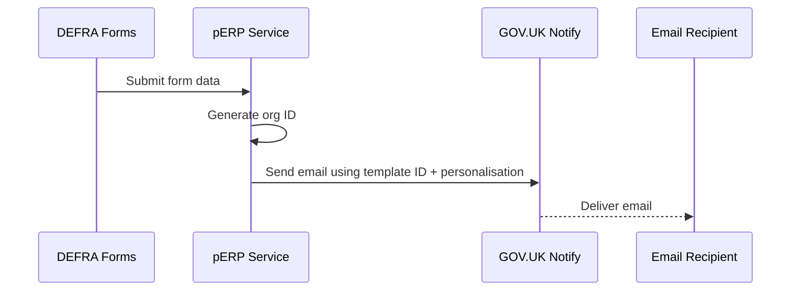

# Contributing

<!-- TOC -->

- [Contributing](#contributing)
  - [Requirements](#requirements)
    - [Node.js](#nodejs)
    - [Secrets](#secrets)
    - [ADR tools](#adr-tools)
  - [Documentation](#documentation)
    - [Architecture Decision Records (ADRs)](#architecture-decision-records-adrs)
  - [Local development](#local-development)
    - [Setup](#setup)
    - [Testing endpoints](#testing-endpoints)
    - [Development](#development)
    - [Testing](#testing)
    - [Production](#production)
    - [Npm scripts](#npm-scripts)
    - [Update dependencies](#update-dependencies)
    - [Formatting](#formatting)
      - [Windows prettier issue](#windows-prettier-issue)
    - [Database GUI](#database-gui)
  - [Development helpers](#development-helpers)
    - [MongoDB Locks](#mongodb-locks)
    - [Proxy](#proxy)
  - [Docker](#docker)
    - [Development image](#development-image)
    - [Production image](#production-image)
    - [Docker Compose](#docker-compose)
  - [Repository](#repository)
    - [Pull Requests](#pull-requests)
    - [Dependabot](#dependabot)
    - [SonarCloud](#sonarcloud)
  - [Deployments](#deployments)
    - [Secrets and Environment Variables](#secrets-and-environment-variables)
  - [ADR: Use of GOV.UK Notify for Email Delivery](#adr-use-of-govuk-notify-for-email-delivery)
    - [Context](#context)
    - [Decision](#decision)
    - [Diagram: Email Trigger Flow](#diagram-email-trigger-flow)
    - [Consequences](#consequences)
  - [GOV.UK Notify Setup](#govuk-notify-setup)
    - [Access](#access)
    - [Using Templates](#using-templates)
    - [Development Notes](#development-notes)
    <!-- TOC -->

## Requirements

### Node.js

Please install [Node.js](http://nodejs.org/) `>= v22` and [npm](https://nodejs.org/) `>= v11`. You will find it
easier to use the Node Version Manager [nvm](https://github.com/creationix/nvm)

To use the correct version of Node.js for this application, via nvm:

```bash
cd epr-backend
nvm use
```

### Secrets

Certain secrets are required to run this repository, to ensure these are safeguarded we use [Docker Compose Secrets](https://docs.docker.com/compose/how-tos/use-secrets/) during local development.

To configure these, please complete the following actions:

1. Obtain the necessary secret values from a team member
2. Create the following Env Var(s):
   - `export GOVUK_NOTIFY_API_KEY=AskTeamMemberForSecretValue`
3. Optionally [persist these Env Vars in your CLI environment](https://unix.stackexchange.com/questions/117467/how-to-permanently-set-environmental-variables)

> [!NOTE]
> Docker Compose secrets cannot be accidentally exposed via `process.env`

> [!IMPORTANT]
> Secrets also need to be managed on CDP, [see here for next steps](#secrets-and-environment-variables)

### ADR tools

To simplify the creation and management of ADRs, please [install ADR tools](https://github.com/npryce/adr-tools/blob/master/INSTALL.md)

## Documentation

Please see the [root `README.md`](./README.md).

### Architecture Decision Records (ADRs)

This project uses ADRs and `adr-tools`, to create new ADRs:

1. Ensure you have [installed adr-tools](#adr-tools)
2. From any directory in the repository: `adr new {name of ADR}`
3. Complete the Context, Decision & Consequence sections
4. Commit and push the code, the TOC file should be updated automatically

## Local development

### Setup

Install application dependencies:

```bash
npm install
```

### Testing endpoints

For basic development and manual testing purposes:

1. Install Postman (or similar)
2. Import the environments and collections from the [postman dir](./postman)
3. Run docker compose
4. [optional] Obtain the API service address with `docker compose ps` and update the Local environment (if necessary)
5. Call the endpoints you want to test via Postman

### Development

> [!TIP]
> You probably won't need this command as you're more likely to need a stack of docker containers running via compose,
> [see below on how to run and access them](#docker-compose).

To run the application in `development` mode run:

```bash
npm run dev
```

### Testing

To test the application run:

```bash
npm run test
```

### Production

To mimic the application running in `production` mode locally run:

```bash
npm start
```

### Npm scripts

All available Npm scripts can be seen in [package.json](./package.json).
To view them in your command line run:

```bash
npm run
```

### Update dependencies

> [!TIP]
> You probably won't need this command as you're more likely to rely on Dependabot,
> [see below for more info](#dependabot).

To update dependencies use [npm-check-updates](https://github.com/raineorshine/npm-check-updates):

> The following script is a good start. Check out all the options on
> the [npm-check-updates](https://github.com/raineorshine/npm-check-updates)

```bash
ncu --interactive --format group
```

### Formatting

#### Windows prettier issue

If you are having issues with formatting of line breaks on Windows update your global git config by running:

```bash
git config --global core.autocrlf false
```

### Database GUI

To access the MongoDB via GUI, you can use whichever database GUI client works best for you.

MongoDB produce their own tools called [Compass (free download)](https://www.mongodb.com/products/tools/compass).

Setup should be zero config, please add steps here if you discover otherwise.

## Development helpers

### MongoDB Locks

If you require a write lock for Mongo you can acquire it via `server.locker` or `request.locker`:

```javascript
async function doStuff(server) {
  const lock = await server.locker.lock('unique-resource-name')

  if (!lock) {
    // Lock unavailable
    return
  }

  try {
    // do stuff
  } finally {
    await lock.free()
  }
}
```

Keep it small and atomic.

You may use **using** for the lock resource management.
Note test coverage reports do not like that syntax.

```javascript
async function doStuff(server) {
  await using lock = await server.locker.lock('unique-resource-name')

  if (!lock) {
    // Lock unavailable
    return
  }

  // do stuff

  // lock automatically released
}
```

Helper methods are also available in `/src/helpers/mongo-lock.js`.

### Proxy

We are using forward-proxy which is set up by default. To make use of this: `import { fetch } from 'undici'` then
because of the `setGlobalDispatcher(new ProxyAgent(proxyUrl))` calls will use the ProxyAgent Dispatcher

If you are not using Wreck, Axios or Undici or a similar http that uses `Request`. Then you may have to provide the
proxy dispatcher:

To add the dispatcher to your own client:

```javascript
import { ProxyAgent } from 'undici'

return await fetch(url, {
  dispatcher: new ProxyAgent({
    uri: proxyUrl,
    keepAliveTimeout: 10,
    keepAliveMaxTimeout: 10
  })
})
```

## Docker

### Development image

Build:

```bash
docker build --target development --no-cache --tag epr-backend:development .
```

Run:

```bash
docker run -e PORT=3001 -p 3001:3001 epr-backend:development
```

### Production image

Build:

```bash
docker build --no-cache --tag epr-backend .
```

Run:

```bash
docker run -e PORT=3001 -p 3001:3001 epr-backend
```

### Docker Compose

A local environment with:

- Localstack for AWS services (S3, SQS)
- Redis
- MongoDB
- This service.
- A commented out frontend example.

```bash
docker compose up --build -d
```

See the running services with:

```bash
docker compose ps
```

## Repository

### Pull Requests

The repository is configured to only allow updates via Pull Requests, please ensure that you follow the [pull request standards](https://defra.github.io/software-development-standards/processes/pull_requests).

### Dependabot

Dependabot is configured for this repository. You can [find the configuration here](.github/dependabot.yml).

### SonarCloud

SonarCloud is configured for this repository. You can [find the configuration here](./sonar-project.properties).

## Deployments

Deployments are managed by CDP, speak with the engineering team to be briefed on this.

Deployments are conducted automatically for lower environments and manually for prod.

### Secrets and Environment Variables

Both secrets and environment variables are managed by CDP, speak with the engineering team to be briefed on this.

# Contributing

<!-- TOC -->

- [Contributing](#contributing)
  - [Requirements](#requirements)
    - [Node.js](#nodejs)
    - [Secrets](#secrets)
    - [ADR tools](#adr-tools)
  - [Documentation](#documentation)
    - [Architecture Decision Records (ADRs)](#architecture-decision-records-adrs)
  - [Local development](#local-development)
    - [Setup](#setup)
    - [Testing endpoints](#testing-endpoints)
    - [Development](#development)
    - [Testing](#testing)
    - [Production](#production)
    - [Npm scripts](#npm-scripts)
    - [Update dependencies](#update-dependencies)
    - [Formatting](#formatting)
      - [Windows prettier issue](#windows-prettier-issue)
    - [Database GUI](#database-gui)
  - [Development helpers](#development-helpers)
    - [MongoDB Locks](#mongodb-locks)
    - [Proxy](#proxy)
  - [Docker](#docker)
    - [Development image](#development-image)
    - [Production image](#production-image)
    - [Docker Compose](#docker-compose)
  - [Repository](#repository)
    - [Pull Requests](#pull-requests)
    - [Dependabot](#dependabot)
    - [SonarCloud](#sonarcloud)
  - [Deployments](#deployments)
    - [Secrets and Environment Variables](#secrets-and-environment-variables)
  - [Demo Applications](#demo-applications)
    - [DEFRA form test](#defra-form-test)
  - [ADR: Use of GOV.UK Notify for Email Delivery](#adr-use-of-govuk-notify-for-email-delivery)
    - [Context](#context)
    - [Decision](#decision)
    - [Diagram: Email Trigger Flow](#diagram-email-trigger-flow)
    - [Consequences](#consequences)
  - [GOV.UK Notify Setup](#govuk-notify-setup)
    - [Access](#access)
    - [Using Templates](#using-templates)
    - [Development Notes](#development-notes)
    <!-- TOC -->

## Requirements

### Node.js

Please install [Node.js](http://nodejs.org/) `>= v22` and [npm](https://nodejs.org/) `>= v11`. You will find it
easier to use the Node Version Manager [nvm](https://github.com/creationix/nvm)

To use the correct version of Node.js for this application, via nvm:

```bash
cd epr-backend
nvm use
```

### Secrets

Certain secrets are required to run this repository, to ensure these are safeguarded we use [Docker Compose Secrets](https://docs.docker.com/compose/how-tos/use-secrets/) during local development.

To configure these, please complete the following actions:

1. Obtain the necessary secret values from a team member
2. Create the following Env Var(s):
   - `export GOVUK_NOTIFY_API_KEY=AskTeamMemberForSecretValue`
3. Optionally [persist these Env Vars in your CLI environment](https://unix.stackexchange.com/questions/117467/how-to-permanently-set-environmental-variables)

> [!NOTE]
> Docker Compose secrets cannot be accidentally exposed via `process.env`

> [!IMPORTANT]
> Secrets also need to be managed on CDP, [see here for next steps](#secrets-and-environment-variables)

### ADR tools

To simplify the creation and management of ADRs, please [install ADR tools](https://github.com/npryce/adr-tools/blob/master/INSTALL.md)

## Documentation

Please see the [root `README.md`](./README.md).

### Architecture Decision Records (ADRs)

This project uses ADRs and `adr-tools`, to create new ADRs:

1. Ensure you have [installed adr-tools](#adr-tools)
2. From any directory in the repository: `adr new {name of ADR}`
3. Complete the Context, Decision & Consequence sections
4. Commit and push the code, the TOC file should be updated automatically

## Local development

### Setup

Install application dependencies:

```bash
npm install
```

### Testing endpoints

For basic development and manual testing purposes:

1. Install Postman (or similar)
2. Import the environments and collections from the [postman dir](./postman)
3. Run docker compose
4. [optional] Obtain the API service address with `docker compose ps` and update the Local environment (if necessary)
5. Call the endpoints you want to test via Postman

### Development

> [!TIP]
> You probably won't need this command as you're more likely to need a stack of docker containers running via compose,
> [see below on how to run and access them](#docker-compose).

To run the application in `development` mode run:

```bash
npm run dev
```

### Testing

To test the application run:

```bash
npm run test
```

### Production

To mimic the application running in `production` mode locally run:

```bash
npm start
```

### Npm scripts

All available Npm scripts can be seen in [package.json](./package.json).
To view them in your command line run:

```bash
npm run
```

### Update dependencies

> [!TIP]
> You probably won't need this command as you're more likely to rely on Dependabot,
> [see below for more info](#dependabot).

To update dependencies use [npm-check-updates](https://github.com/raineorshine/npm-check-updates):

> The following script is a good start. Check out all the options on
> the [npm-check-updates](https://github.com/raineorshine/npm-check-updates)

```bash
ncu --interactive --format group
```

### Formatting

#### Windows prettier issue

If you are having issues with formatting of line breaks on Windows update your global git config by running:

```bash
git config --global core.autocrlf false
```

### Database GUI

To access the MongoDB via GUI, you can use whichever database GUI client works best for you.

MongoDB produce their own tools called [Compass (free download)](https://www.mongodb.com/products/tools/compass).

Setup should be zero config, please add steps here if you discover otherwise.

## Development helpers

### MongoDB Locks

If you require a write lock for Mongo you can acquire it via `server.locker` or `request.locker`:

```javascript
async function doStuff(server) {
  const lock = await server.locker.lock('unique-resource-name')

  if (!lock) {
    // Lock unavailable
    return
  }

  try {
    // do stuff
  } finally {
    await lock.free()
  }
}
```

Keep it small and atomic.

You may use **using** for the lock resource management.
Note test coverage reports do not like that syntax.

```javascript
async function doStuff(server) {
  await using lock = await server.locker.lock('unique-resource-name')

  if (!lock) {
    // Lock unavailable
    return
  }

  // do stuff

  // lock automatically released
}
```

Helper methods are also available in `/src/helpers/mongo-lock.js`.

### Proxy

We are using forward-proxy which is set up by default. To make use of this: `import { fetch } from 'undici'` then
because of the `setGlobalDispatcher(new ProxyAgent(proxyUrl))` calls will use the ProxyAgent Dispatcher

If you are not using Wreck, Axios or Undici or a similar http that uses `Request`. Then you may have to provide the
proxy dispatcher:

To add the dispatcher to your own client:

```javascript
import { ProxyAgent } from 'undici'

return await fetch(url, {
  dispatcher: new ProxyAgent({
    uri: proxyUrl,
    keepAliveTimeout: 10,
    keepAliveMaxTimeout: 10
  })
})
```

## Docker

### Development image

Build:

```bash
docker build --target development --no-cache --tag epr-backend:development .
```

Run:

```bash
docker run -e PORT=3001 -p 3001:3001 epr-backend:development
```

### Production image

Build:

```bash
docker build --no-cache --tag epr-backend .
```

Run:

```bash
docker run -e PORT=3001 -p 3001:3001 epr-backend
```

### Docker Compose

A local environment with:

- Localstack for AWS services (S3, SQS)
- Redis
- MongoDB
- This service.
- A commented out frontend example.

```bash
docker compose up --build -d
```

See the running services with:

```bash
docker compose ps
```

## Repository

### Pull Requests

The repository is configured to only allow updates via Pull Requests, please ensure that you follow the [pull request standards](https://defra.github.io/software-development-standards/processes/pull_requests).

### Dependabot

Dependabot is configured for this repository. You can [find the configuration here](.github/dependabot.yml).

### SonarCloud

SonarCloud is configured for this repository. You can [find the configuration here](./sonar-project.properties).

## Deployments

Deployments are managed by CDP, speak with the engineering team to be briefed on this.

Deployments are conducted automatically for lower environments and manually for prod.

### Secrets and Environment Variables

Both secrets and environment variables are managed by CDP, speak with the engineering team to be briefed on this.

## Demo applications

### DEFRA form test

This test form is used to support integration between the DEFRA Forms platform and the pERP service. It provides a safe, standalone environment for developers to verify that form submissions (including file uploads) are correctly received and processed by our system.

Having our own dedicated form allows us to:

- Perform integration tests independently of external teams or production forms
- Validate form-to-endpoint communication and end-to-end behaviour
- Debug and iterate in a controlled setting without relying on live forms

To activate the integration, we must provide the DEFRA Forms team with our endpoint so they can configure the test form to send submissions to it.

- name: pERP test form
- [Link to form](https://forms-designer.test.cdp-int.defra.cloud/library/pepr-test-form)
- All applications will be sent to [ERP service email](mailto:REEXServiceTeam@defra.gov.uk)

## ADR: Use of GOV.UK Notify for Email Delivery

### Context

Our system needs to send emails as part of the organisation registration and accreditation process. These include confirmation emails to users and notifications to regulators.

To avoid building and maintaining our own email infrastructure, we integrate with [GOV.UK Notify](https://www.notifications.service.gov.uk/), a government-approved platform for sending transactional emails.

### Decision

We will use GOV.UK Notify to send system-generated emails triggered by form submissions. This allows us to:

- Centralise and manage email templates via the GOV.UK Notify dashboard
- Simplify integration via a standard API
- Use a secure, government-trusted delivery service

Emails are triggered after we receive submission data, and reference GOV.UK Notify templates by ID. We populate the required placeholders (e.g. organisation ID) and send a request via the GOV.UK Notify API.

To use GOV.UK Notify in this project:

- An email template must be created in the GOV.UK Notify dashboard
- We must provide Notify with a list of allowed email recipients (in non-live mode)
- The template’s ID is referenced in code and populated with submission data

> Template creation and access must be done via the GOV.UK Notify web interface. Developers will need access to the team account.

### Diagram: Email Trigger Flow



### GOV.UK Notify Setup

We use [GOV.UK Notify](https://www.notifications.service.gov.uk/) to send automated emails from the pERP service.

#### Access

- Request to be added to the GOV.UK Notify team account.
- All templates are created and managed in the Notify dashboard.

#### Using Templates

- Each email template has a **Template ID**.
- This ID is referenced in code and populated with submission data before sending.
- Placeholders in templates (e.g. `((org_id))`) are replaced at runtime.

#### Development Notes

- API keys are stored securely in CDP — never commit them to the repo.
- New templates must be created in Notify and their IDs updated in code.
- In non-live mode, only approved recipient email addresses can be used.
