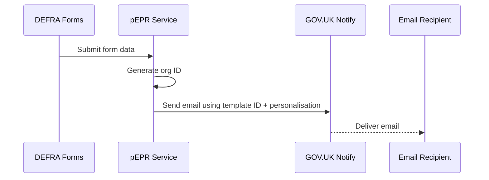

# 3. GOV.UK Notify

Date: 2025-08-11

## Status

Accepted

## Context

Our system needs to send emails as part of the organisation registration and accreditation process. These include confirmation emails to users and notifications to regulators.

To avoid building and maintaining our own email infrastructure, we integrate with [GOV.UK Notify](https://www.notifications.service.gov.uk/), a government-approved platform for sending transactional emails.

## Decision

We will use GOV.UK Notify to send system-generated emails triggered by form submissions. This allows us to:

- Centralise and manage email templates via the GOV.UK Notify dashboard
- Simplify integration via a standard API
- Use a secure, government-trusted delivery service

Emails are triggered after we receive submission data, and reference GOV.UK Notify templates by ID. We populate the required placeholders (e.g. organisation ID) and send a request via the GOV.UK Notify API.

To use GOV.UK Notify in this project:

- An email template must be created in the GOV.UK Notify dashboard
- We must provide GOV.UK Notify with a list of allowed email recipients (in non-live mode)
- The template’s ID is referenced in code and populated with submission data

> Template creation and access must be done via the GOV.UK Notify web interface. Developers will need access to the team account.

## Diagram: Email Trigger Flow

## GOV.UK Notify Setup

We use [GOV.UK Notify](https://www.notifications.service.gov.uk/) to send automated emails from the pEPR service.

### Access

- Request to be added to the GOV.UK Notify team account.
- All templates are created and managed in the GOV.UK Notify dashboard.

### Using Templates

- Each email template has a **Template ID**.
- This ID is referenced in code and populated with submission data before sending.
- Placeholders in templates (e.g. `((org_id))`) are replaced at runtime with values from our system, mapped from the form submission data or generated internally (e.g. `org_id` is created when the organisation form is processed).  
  See the [GOV.UK Notify personalisation documentation](https://www.notifications.service.gov.uk/using-notify/guidance/personalisation) for details on how placeholders work.

### Development Notes

- API keys are stored securely in CDP — never commit them to the repo. See [Secrets](#secrets) for how to handle them.
- New templates must be created in GOV.UK Notify and their IDs updated in code.
- In non-live mode, only approved recipient email addresses can be used.
