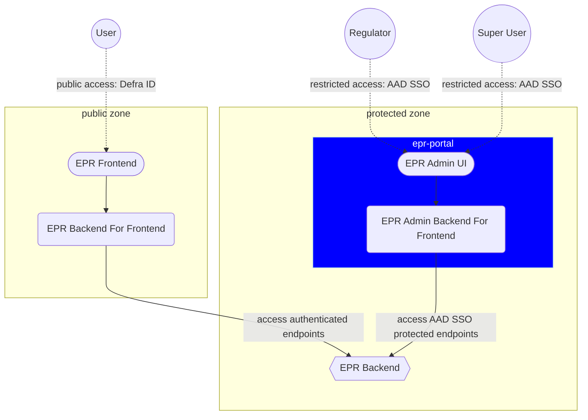

# 5. Admin UI

Date: 2025-09-12

## Status

Accepted

## Context

As a team building systems for the Reprocessors and Exporters side of the EPR (Extended Producer Responsibilities) service we need to fulfill the needs of various privileged stakeholders in the space including administrators of the service and the Regulator.

At the moment, there isn't a way for those stakeholders to access the information submitted by the Operators (Reprocessors and Exporters) and kept in our service's database.

It's especially pressing for the team supporting the EPR service to gain the ability to debug potential problems with the existing forms for submitting `organisation`, `registration` and `accreditation` information as soon as possible, as mentioned in the [Data Extraction ADR](0004-data-extraction.md).

## Decision

We have chosen to build an Admin UI (`epr-portal`) for the EPR service.

The goal of the service is to act as an administrative tool for both system administrators and for the Regulator of EPR service to perform their duties based on different user's authorisation levels.

### Service features

The service will have the following characteristics:

- It will be based on the CDP Node.js Frontend Template
- It will live in CDP's private zone with all users signing in via AAD/SSO
- The `server` part of the service will act as a backend for the frontend (BFF approach) taking care of
  auth flows, enforcing security policies where applicable, and potentially, a number of other tasks
- It will use a simple role-based access control model (RBAC) to provide the best user experience and prevent unnecessary requests to `epr-backend` from unauthorised users

### Place in the architecture

The following diagram outlines how `epr-portal` fits into the overall architecture of the EPR service:

### Other considerations

This service is taking inspiration from the following projects in the CDP space:

- [CDP Portal Frontend](https://github.com/DEFRA/cdp-portal-frontend)
- [Forms Designer](https://github.com/DEFRA/forms-designer)
- [BTMS Portal Frontend](https://github.com/DEFRA/btms-portal-frontend)

A PoC of a first private endpoint in the `epr-backend` service is already underway, which is helping refine the system's requirements and future ADRs.

## Consequences

Having an Admin UI in CDP's private space adds an additional layer of security to the system by making access to the private network an additional requirement.

From the organisational point of view, it establishes a clear separation between the publicly and privately accessible functions while helping the product team to separate concerns and define parallel streams of works, which will help us divide our tasks.

The full scope of the project is still being defined as part of the (High Level Design)(../discovery/pepr-hld.md), but we believe there are no risks associated with creating an Admin UI as a starting point for managing the needs of system administrators and the Regulator, and as a gateway to the protected endpoints in `epr-backend`.
