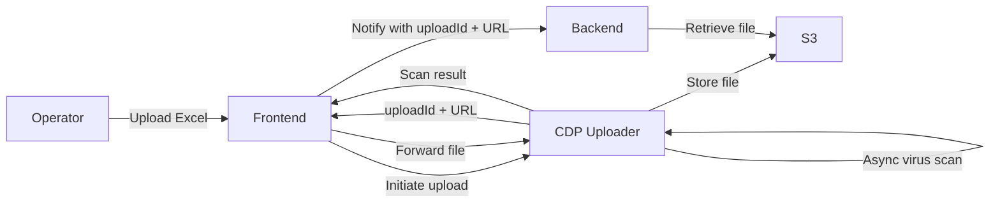

# 8. File upload

Date: 2025-09-30

## Status

Accepted

## Context

Our registered users will need to upload a Summary Log that is in Excel. These files come from external users, so there is a possibility that they are unsasfe. We need to:

- accepted the file upload
- scan for viruses before we store them
- stored in a reliable location for later validation/processing

The Core Delivery Platform (CDP) provides a managed Uploader service that does exactly this. It takes care of file acceptance, virus scanning and storage in S3. Using it means we don’t have to build our own file handling pipeline.

## Decision

We will integrate with CDP Uploader for our file uploads.

The flow works like this:

- The frontend asks CDP to start an upload, and CDP gives back an `uploadId` and URL.
- The operator uploads their Excel file directly to CDP.
- CDP runs an async virus scan.
- CDP stores the file in our S3 bucket.
- If the file is clean, CDP calls back to the frontend.
- The frontend calls the backend with the `uploadId` and the URL.
- The backend retrieves the file from S3 for further processing.

### Flow Diagram

## Consequences

- Security is handled for us: every file is scanned before the backend sees it.
- We avoid the cost of building and maintaining our own file upload + virus scanning stack.
- This follows the recommended CDP approach, so we stay aligned with other services.
- On the downside, running this locally means pulling in CDP Uploader (with localstack/Docker), which makes dev setup a bit heavier.
- There’s also an extra layer of indirection (uploadId/GUID), so debugging may involve looking in multiple places.
