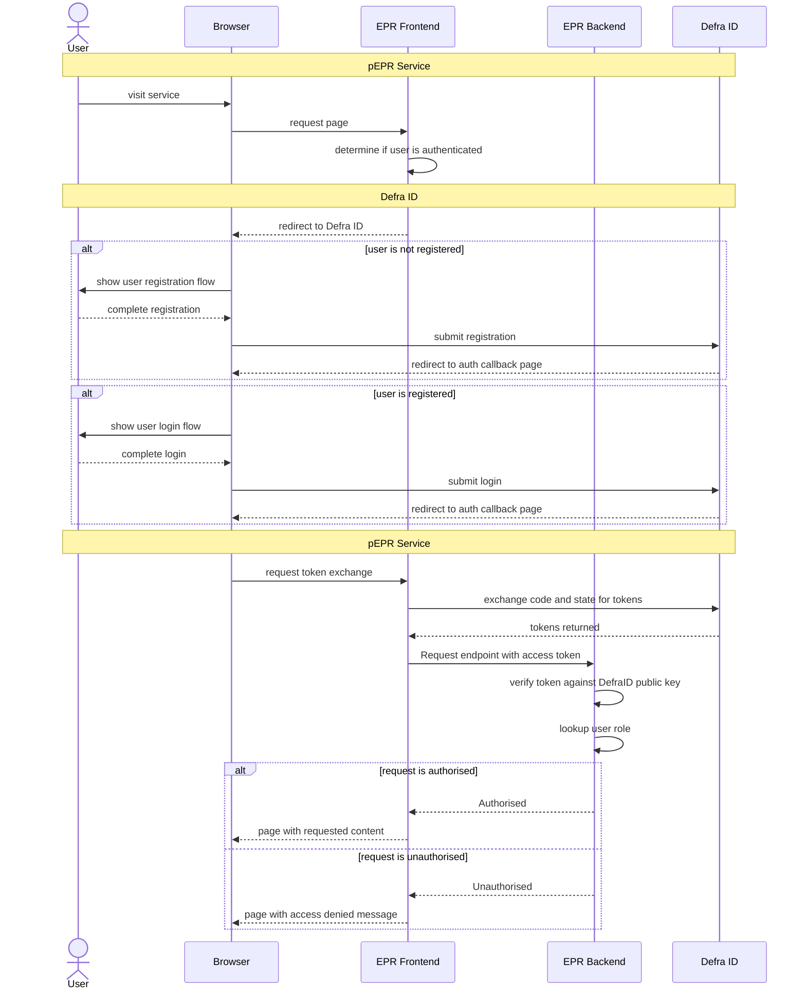

# 13. Defra ID

Date: 2025-10-08

## Status

Accepted

## Context

As a Defra digital service we need to ensure that public users are Authenticated to access our service
and Authorised to read/write data associated to their access within the service.

## Decision

As a foregone conclusion, we are required to use DefraID as it provides a consistent experience for users,
especially where those users access more than one Defra digital service.

[Relevant resources can be found here](https://eaflood.atlassian.net/wiki/spaces/MWR/pages/5952995350/Defra+ID)

## Consequences

Primarily, the consequences are positive in that a single centralised service is used for Authentication that provides a consistent experience for users.

That said, there are some [potential downsides documented in Confluence](https://eaflood.atlassian.net/wiki/spaces/MWR/pages/5966299368/Defra+ID+issues) for privacy reasons.
