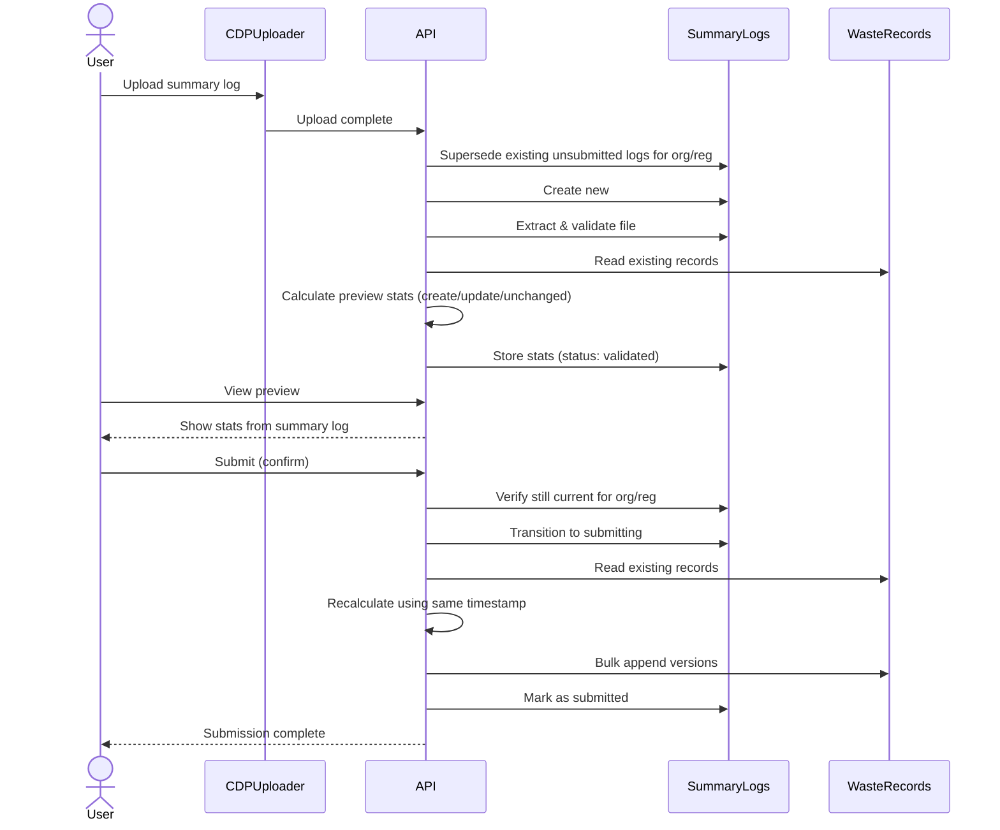
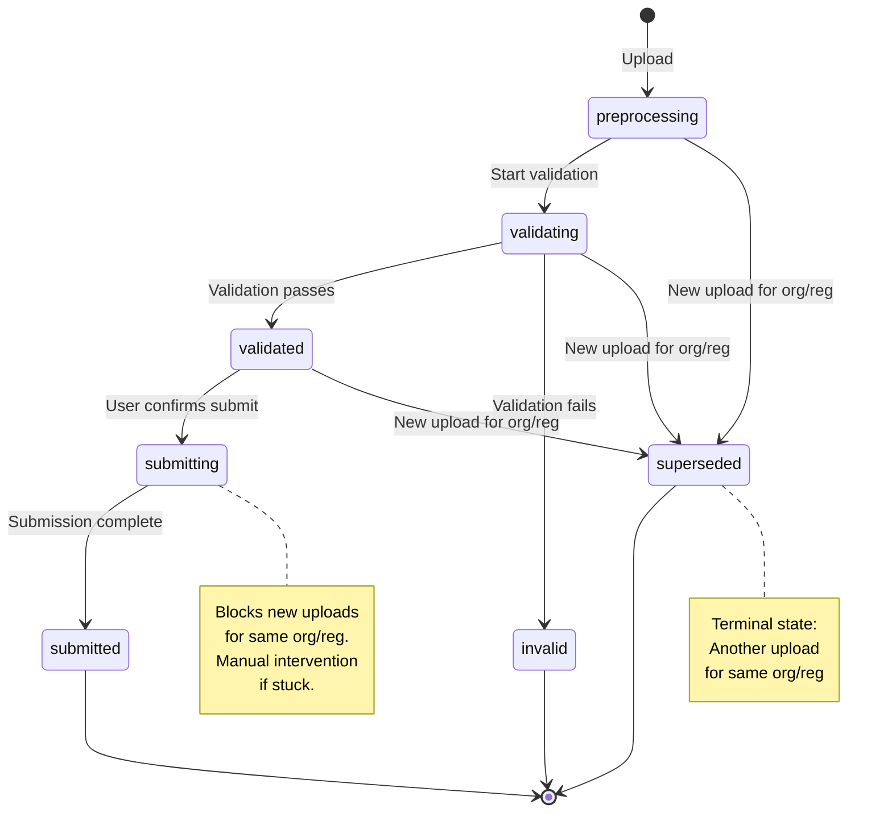
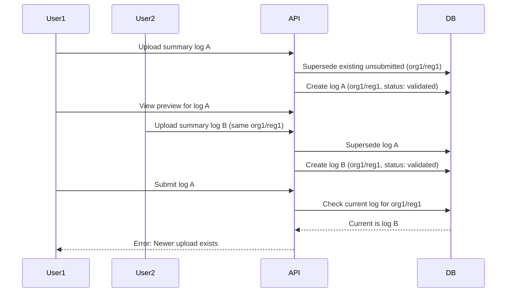
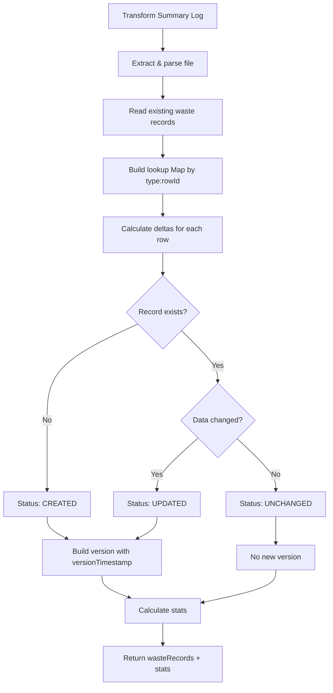
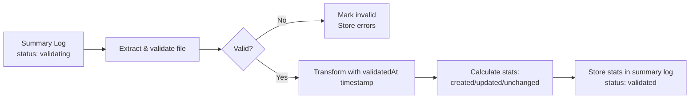
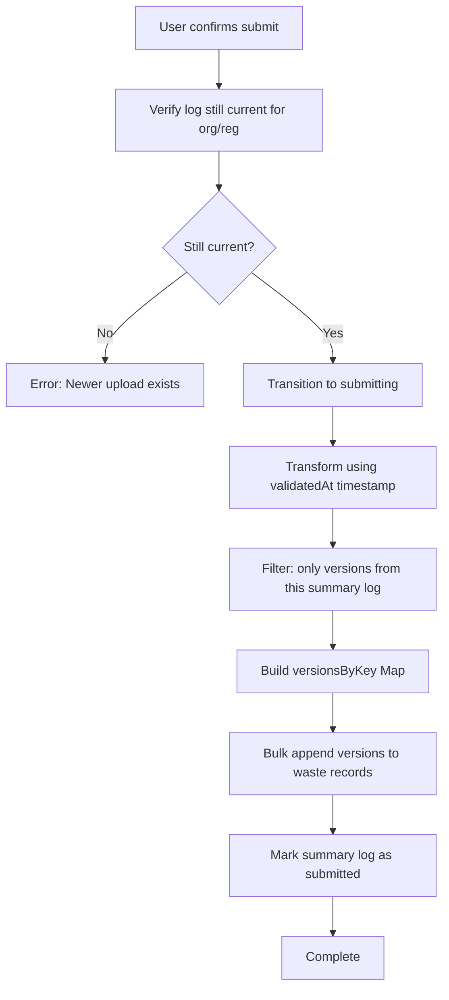

# 21. Concurrent Summary Log Submission and Waste Record Versioning

Date: 2025-01-11

## Status

Proposed

## Context

When a user submits a summary log, the system must update potentially thousands of waste records by appending new versions to each record's version history. A typical summary log may contain up to 15,000 rows, with tens of values per row.

This operation presents several challenges:

1. **Stale Previews**: If a user views a preview and another summary log is uploaded before they submit, the preview becomes incorrect
2. **Concurrency Control**: Multiple users might attempt to submit summary logs for the same organisation/registration simultaneously
3. **Partial Failure Recovery**: The system could crash mid-submission, leaving some waste records updated and others not
4. **Data Consistency**: Users need to see consistent data, but full atomic transactions are not practical
5. **Performance**: Processing 15,000 records must complete in reasonable time
6. **Idempotency**: Retrying a failed submission must not create duplicate versions

### Scale Constraints

- Up to 15,000 waste records per summary log
- Each record contains multiple fields (tens of values)
- MongoDB transaction size limit: 16MB
- MongoDB transaction time limit: 60 seconds
- These constraints make multi-document transactions impractical for this use case

### Acceptable Trade-offs

- **Last upload wins**: Only one unsubmitted summary log per organisation/registration at a time. New uploads supersede previous unsubmitted ones.
- **Partial visibility is acceptable**: Users can see updates in progress via the summary log "submitting" status
- **Eventual consistency is acceptable**: Brief periods where some waste records are updated before others
- **Manual recovery initially**: Stuck submissions require manual investigation and retry rather than automated recovery

### Key Constraint

**One active summary log per organisation/registration**: The system enforces that only one summary log in an active state can exist for a given organisation/registration pair at any time. When a new summary log is uploaded:

1. If an existing summary log is in `submitting` state for that org/reg, the upload is **rejected** with an error message
2. Any existing summary logs in unsubmitted states (`validated`, `validating`, `preprocessing`) for that org/reg are superseded
3. The new upload becomes the current active summary log
4. On submit, the system verifies the summary log ID matches the current one for that org/reg

This constraint eliminates stale preview issues and prevents partial data from superseded submissions. Uploads are blocked during submission to ensure clean state transitions.

## Decision

We will implement a **multi-layered strategy** combining org/reg level constraints, optimistic locking, two-phase workflow (validate/preview then submit), idempotent operations, and bulk processing.

### Overall Workflow



### Summary Log Status Transitions



### 1. Organisation/Registration Level Constraint

The system enforces that only one active summary log can exist per organisation/registration pair. Uploads are blocked during submission, and "last upload wins" for unsubmitted logs.



**Key Operations:**

On upload, check for active submission and supersede unsubmitted logs:

```javascript
// 1. Block if submission in progress
const submitting = await findOne({
  organisationId,
  registrationId,
  status: 'submitting'
})
if (submitting) {
  throw Boom.conflict('A submission is in progress. Please wait.')
}

// 2. Supersede unsubmitted logs
status: { $in: ['preprocessing', 'validating', 'validated'] }
  → status: 'superseded'
```

On submit, verify still current:

```javascript
// Ensure this log is still the current validated one
if (currentValidatedLog.id !== submittedLogId) {
  throw Boom.conflict('A newer summary log has been uploaded')
}
```

**Rationale:**

- Blocks uploads during submission to prevent partial data from superseded logs
- Last upload wins for unsubmitted logs - simple mental model
- Eliminates stale preview problem entirely
- Clear error messages guide users
- Atomic operations ensure constraint is enforced reliably

### 2. Repository Port Design

The waste records repository provides a focused interface:

```javascript
interface WasteRecordsRepository {
  // Read all waste records for an organisation/registration
  findByRegistration(organisationId, registrationId): Promise<WasteRecord[]>

  // Append versions in bulk (Map keyed by "type:rowId")
  appendVersions(organisationId, registrationId, accreditationId,
                 versionsByKey: Map<string, VersionAppend>): Promise<void>
}
```

**Rationale:**

- Application layer: business logic (delta calculation, change detection)
- Repository layer: persistence (version appending, bulk operations)
- Single Map parameter groups all updates for one org/registration batch
- Map key `"type:rowId"` handles multiple waste record types in one summary log

### 3. Shared Transformation Logic

Both validation and submission use identical transformation logic to ensure deterministic results.



**Rationale:**

- Single source of truth for transformation logic
- Both phases use identical code path - no divergence possible
- Reusing `validatedAt` timestamp keeps times consistent across rows
- Returns both waste records (for submission) and stats (for preview)

### 4. Validation Phase

During validation, calculate preview statistics for user review:



**Key Points:**

- Preview stats stored in summary log: `{ previewStats: { created: 1234, updated: 567, unchanged: 89 } }`
- Full waste records NOT stored (would exceed 16MB for 15k records)
- Uses `validatedAt` timestamp for deterministic version creation
- User views preview page showing the stored `previewStats`

### 5. Submission Phase

After user confirms preview, persist the changes:



**Key Points:**

- Uses same transformation logic as validation phase
- Reuses `validatedAt` timestamp for consistent times across rows
- Org/reg constraint check prevents stale submissions
- Bulk operation handles up to 15k records efficiently
- On failure, leaves in 'submitting' state for recovery

### 6. MongoDB Adapter Implementation

The MongoDB adapter uses bulk operations for efficient version appending:

```javascript
// For each waste record in versionsByKey Map:
{
  updateOne: {
    filter: { _compositeKey: "org:reg:type:rowId" },
    update: {
      $setOnInsert: { /* static fields (only on create) */ },
      $set: { data: currentData },
      $push: { versions: version }
    },
    upsert: true
  }
}

// Execute with: bulkWrite(ops, { ordered: false })
```

**Key MongoDB Operations:**

- `$setOnInsert`: Static fields only when creating new document
- `$set`: Update top-level data on every operation
- `$push`: Append version to versions array
- `upsert: true`: Create document if doesn't exist
- `ordered: false`: Continue processing if one operation fails

## Consequences

### Positive

- **No stale previews**: Org/reg constraint ensures preview is always for current unsubmitted summary log
- **Clean submissions**: Blocking uploads during submission prevents partial data from superseded logs
- **Simple mental model**: Last upload wins for unsubmitted logs, blocked during submission
- **User confirmation**: Preview during validation allows users to review changes before committing
- **Handles large scale**: Efficiently processes up to 15,000+ waste records
- **Prevents race conditions**: Org/reg constraint + optimistic locking on summary log status
- **Consistent recalculation**: Shared transformation logic ensures submitted versions match preview
- **Crash-safe**: Idempotency allows safe retry after partial failure
- **No transactions required**: Works within MongoDB's practical limits
- **Performance**: Minimal database round-trips per phase
  - Validation: 1 bulk read (existing records) + calculation + store stats
  - Submit: 1 bulk read (existing records) + 1 bulk write (all version appends)
  - Application memory: Holds all records in memory during processing (manageable for 15k records)

### Negative

- **Last upload wins**: Users who are reviewing a preview will get an error if someone uploads a newer summary log
  - Trade-off: Simpler than allowing multiple concurrent previews and dealing with merge conflicts
  - Clear error message guides user to review the newer upload
- **Uploads blocked during submission**: Users must wait if a submission is in progress
  - Trade-off: Prevents partial data from superseded logs, ensures clean state transitions
  - Wait time expected to be short for typical workloads
- **Two-phase overhead**: Calculates transformations twice (validation + submit)
  - Trade-off: User confidence and confirmation outweighs computational cost
  - Org/reg constraint prevents wasted work (only one summary log being worked on at a time)
- **Memory usage**: Application holds all existing records in memory during processing
  - For 15k records: acceptable on modern infrastructure
  - If this becomes a constraint, can batch the Map building and writes
- **Application complexity**: Delta calculation and status logic in application layer
  - Trade-off: simpler repository, clearer separation of concerns
- **Manual recovery required**: Stuck submissions require manual intervention
  - Trade-off: Simpler initial implementation, addresses real failures rather than transient issues

### Implementation Notes

1. Reusing `validatedAt` timestamp keeps version timestamps consistent across all rows
2. The `versions` array in waste records naturally supports idempotency via `summaryLog.id` checking
3. Preview stats stored in summary log: `{ previewStats: { created: 1234, updated: 567, unchanged: 89 } }`
4. Idempotency check happens in application layer before building the Map (avoids unnecessary writes)
5. Map key format `"type:rowId"` naturally groups versions by waste record
6. New uploads must supersede existing unsubmitted summary logs for the same org/reg
7. Submit must verify the summary log is still current before processing
8. The `superseded` status is a terminal state (no further transitions allowed)
9. If memory usage becomes a concern with >15k records, batch the Map building and multiple `appendVersions` calls

### Future Considerations

- **Automated recovery**: Implement a background job to detect and recover stuck submissions (status: `submitting`, older than threshold). The job would re-run the submission leveraging idempotency to handle partial completions. This could reduce manual intervention but adds operational complexity.
- **Concurrent updates**: If waste records need to support concurrent updates from multiple sources (not just summary logs), add a `version` field to waste records for optimistic locking
- **Batched processing**: If memory usage exceeds infrastructure limits, implement batched processing (multiple smaller Maps and `appendVersions` calls)
- **Async processing**: If processing time exceeds acceptable limits, consider async processing via queue worker
