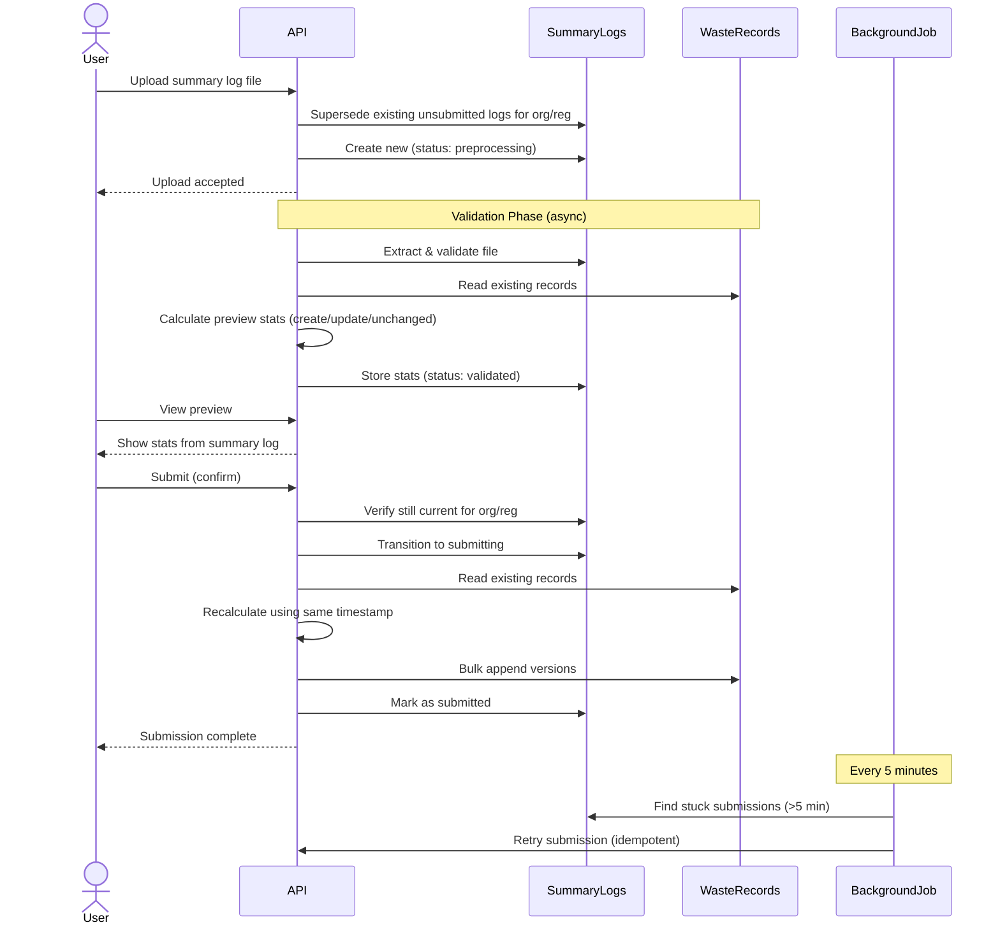
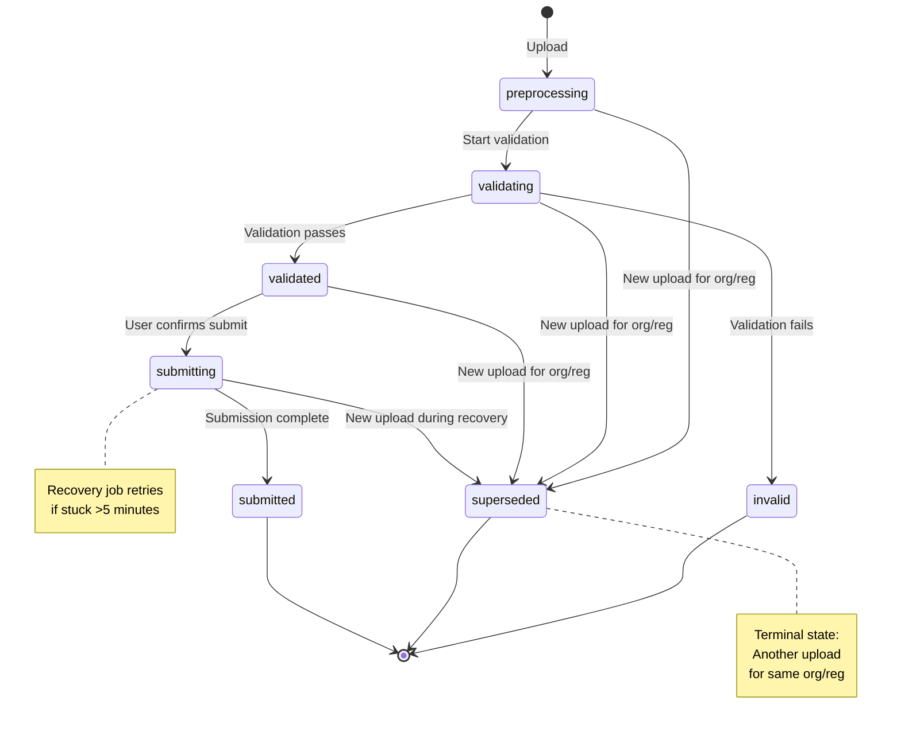
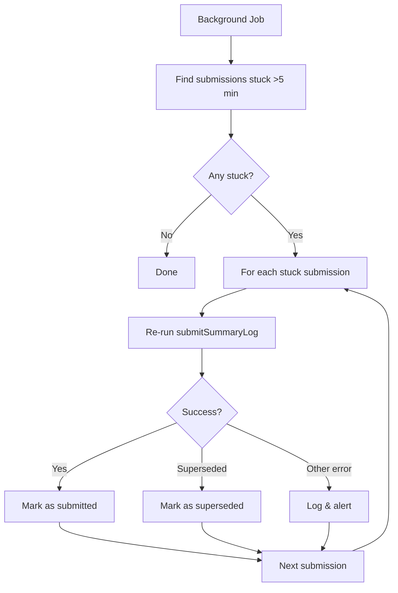

# 21. Concurrent Summary Log Submission and Waste Record Versioning

Date: 2025-01-11

## Status

Proposed

## Context

When a user submits a summary log, the system must update potentially thousands of waste records by appending new versions to each record's version history. A typical summary log may contain up to 15,000 rows, with tens of values per row.

This operation presents several challenges:

1. **Stale Previews**: If a user views a preview and another summary log is uploaded before they submit, the preview becomes incorrect
2. **Concurrency Control**: Multiple users might attempt to submit summary logs for the same organisation/registration simultaneously
3. **Partial Failure Recovery**: The system could crash mid-submission, leaving some waste records updated and others not
4. **Data Consistency**: Users need to see consistent data, but full atomic transactions are not practical
5. **Performance**: Processing 15,000 records must complete in reasonable time
6. **Idempotency**: Retrying a failed submission must not create duplicate versions

### Scale Constraints

- Up to 15,000 waste records per summary log
- Each record contains multiple fields (tens of values)
- MongoDB transaction size limit: 16MB
- MongoDB transaction time limit: 60 seconds
- These constraints make multi-document transactions impractical for this use case

### Acceptable Trade-offs

- **Last upload wins**: Only one unsubmitted summary log per organisation/registration at a time. New uploads supersede previous unsubmitted ones.
- **Partial visibility is acceptable**: Users can see updates in progress via the summary log "submitting" status
- **Eventual consistency is acceptable**: Brief periods where some waste records are updated before others
- **Forward recovery preferred**: On failure, complete the submission rather than roll back

### Key Constraint

**One unsubmitted summary log per organisation/registration**: The system enforces that only one summary log in an unsubmitted state (`validated`, `validating`, `preprocessing`) can exist for a given organisation/registration pair at any time. When a new summary log is uploaded:

1. Any existing unsubmitted summary logs for that org/reg are superseded
2. The new upload becomes the current unsubmitted summary log
3. On submit, the system verifies the summary log ID matches the current one for that org/reg

This constraint eliminates stale preview issues: if another summary log is uploaded while a user views a preview, their submit will fail with a clear message that a newer upload exists.

## Decision

We will implement a **multi-layered strategy** combining org/reg level constraints, optimistic locking, two-phase workflow (validate/preview then submit), idempotent operations, batch processing, and forward recovery.

### Overall Workflow



### Summary Log Status Transitions



### 1. Organisation/Registration Level Constraint (Prevents Stale Previews)

The system enforces that only one unsubmitted summary log can exist per organisation/registration pair. This "last upload wins" policy eliminates stale previews.


**Key Operations:**

On upload, supersede existing unsubmitted logs:

```javascript
// Mark all unsubmitted logs for this org/reg as superseded
status: { $in: ['preprocessing', 'validating', 'validated'] }
  → status: 'superseded'
```

On submit, verify still current:

```javascript
// Ensure this log is still the current validated one
if (currentValidatedLog.id !== submittedLogId) {
  throw Boom.conflict('A newer summary log has been uploaded')
}
```

**Rationale:**

- Last upload wins - simple mental model
- Eliminates stale preview problem entirely
- Clear error message if user attempts to submit superseded log
- Atomic operations ensure constraint is enforced reliably

### 2. Repository Port Design

The waste records repository provides a focused interface:

```javascript
interface WasteRecordsRepository {
  // Read all waste records for an organisation/registration
  findByRegistration(organisationId, registrationId): Promise<WasteRecord[]>

  // Append versions in bulk (Map keyed by "type:rowId")
  appendVersions(organisationId, registrationId, accreditationId,
                 versionsByKey: Map<string, VersionAppend>): Promise<void>
}
```

**Rationale:**

- Application layer: business logic (delta calculation, change detection)
- Repository layer: persistence (version appending, bulk operations)
- Single Map parameter groups all updates for one org/registration batch
- Map key `"type:rowId"` handles multiple waste record types in one summary log

### 3. Shared Transformation Logic

Both validation and submission use identical transformation logic to ensure deterministic results.


**Rationale:**

- Single source of truth for transformation logic
- Both phases use identical code path - no divergence possible
- Reusing `validatedAt` timestamp keeps times consistent across rows
- Returns both waste records (for submission) and stats (for preview)

### 4. Validation Phase

During validation, calculate preview statistics for user review:


**Key Points:**

- Preview stats stored in summary log: `{ previewStats: { created: 1234, updated: 567, unchanged: 89 } }`
- Full waste records NOT stored (would exceed 16MB for 15k records)
- Uses `validatedAt` timestamp for deterministic version creation
- User views preview page showing the stored `previewStats`

### 5. Submission Phase

After user confirms preview, persist the changes:


**Key Points:**

- Uses same transformation logic as validation phase
- Reuses `validatedAt` timestamp for consistent times across rows
- Org/reg constraint check prevents stale submissions
- Bulk operation handles up to 15k records efficiently
- On failure, leaves in 'submitting' state for recovery

### 6. MongoDB Adapter Implementation

The MongoDB adapter uses bulk operations for efficient version appending:

```javascript
// For each waste record in versionsByKey Map:
{
  updateOne: {
    filter: { _compositeKey: "org:reg:type:rowId" },
    update: {
      $setOnInsert: { /* static fields (only on create) */ },
      $set: { data: currentData },
      $push: { versions: version }
    },
    upsert: true
  }
}

// Execute with: bulkWrite(ops, { ordered: false })
```

**Key MongoDB Operations:**

- `$setOnInsert`: Static fields only when creating new document
- `$set`: Update top-level data on every operation
- `$push`: Append version to versions array
- `upsert: true`: Create document if doesn't exist
- `ordered: false`: Continue processing if one operation fails

### 7. Forward Recovery via Background Job

Background job recovers stuck submissions (runs every 5 minutes):



**Recovery Strategy:**

- Forward recovery only (complete the submission, don't roll back)
- Leverages idempotency - safe to retry partial completions
- Handles superseded logs gracefully
- No need to track partial progress
- Alerts on repeated failures

**Query:**

```javascript
// Find stuck submissions
{ status: 'submitting', submissionStartedAt: { $lt: fiveMinutesAgo } }
```

## Consequences

### Positive

- **No stale previews**: Org/reg constraint ensures preview is always for current unsubmitted summary log
- **Simple mental model**: Last upload wins - easy for users to understand
- **User confirmation**: Preview during validation allows users to review changes before committing
- **Handles large scale**: Efficiently processes up to 15,000+ waste records
- **Prevents race conditions**: Org/reg constraint + optimistic locking on summary log status
- **Consistent recalculation**: Shared transformation logic ensures submitted versions match preview
- **Crash-safe**: Idempotency allows safe retry after partial failure
- **No transactions required**: Works within MongoDB's practical limits
- **Forward recovery**: Simple, predictable recovery mechanism
- **Performance**: Minimal database round-trips per phase
  - Validation: 1 bulk read (existing records) + calculation + store stats
  - Submit: 1 bulk read (existing records) + 1 bulk write (all version appends)
  - Estimated time for 15k records: 10-30 seconds per phase
  - Application memory: Holds all records in memory during processing (manageable for 15k records)

### Negative

- **Last upload wins**: Users who are reviewing a preview will get an error if someone uploads a newer summary log
  - Trade-off: Simpler than allowing multiple concurrent previews and dealing with merge conflicts
  - Clear error message guides user to review the newer upload
- **Two-phase overhead**: Calculates transformations twice (validation + submit)
  - Trade-off: User confidence and confirmation outweighs computational cost
  - Org/reg constraint prevents wasted work (only one summary log being worked on at a time)
- **Memory usage**: Application holds all existing records in memory during processing
  - For 15k records: acceptable on modern infrastructure
  - If this becomes a constraint, can batch the Map building and writes
- **Application complexity**: Delta calculation and status logic in application layer
  - Trade-off: simpler repository, clearer separation of concerns
- **Recovery delay**: Stuck submissions detected after 5 minutes
  - Forward recovery completes them
  - Acceptable trade-off vs. immediate detection complexity

### Implementation Notes

1. Reusing `validatedAt` timestamp keeps version timestamps consistent across all rows
2. The `submissionStartedAt` timestamp on the summary log enables stuck submission detection
3. The `versions` array in waste records naturally supports idempotency via `summaryLog.id` checking
4. Preview stats stored in summary log: `{ previewStats: { created: 1234, updated: 567, unchanged: 89 } }`
5. Idempotency check happens in application layer before building the Map (avoids unnecessary writes)
6. Map key format `"type:rowId"` naturally groups versions by waste record
7. The recovery job should include alerting if operations repeatedly fail
8. The recovery job should use exponential backoff if an operation continues to fail
9. New uploads must supersede existing unsubmitted summary logs for the same org/reg
10. Submit must verify the summary log is still current before processing
11. The `superseded` status is a terminal state (no further transitions allowed)
12. If memory usage becomes a concern with >15k records, batch the Map building and multiple `appendVersions` calls

### Future Considerations

- If waste records need to support concurrent updates from multiple sources (not just summary logs), add a `version` field to waste records for optimistic locking
- If recovery time needs to be faster, reduce the stuck threshold or implement active monitoring
- If memory usage exceeds infrastructure limits, implement batched processing (multiple smaller Maps and `appendVersions` calls)
- If processing time exceeds acceptable limits, consider async processing via queue worker
