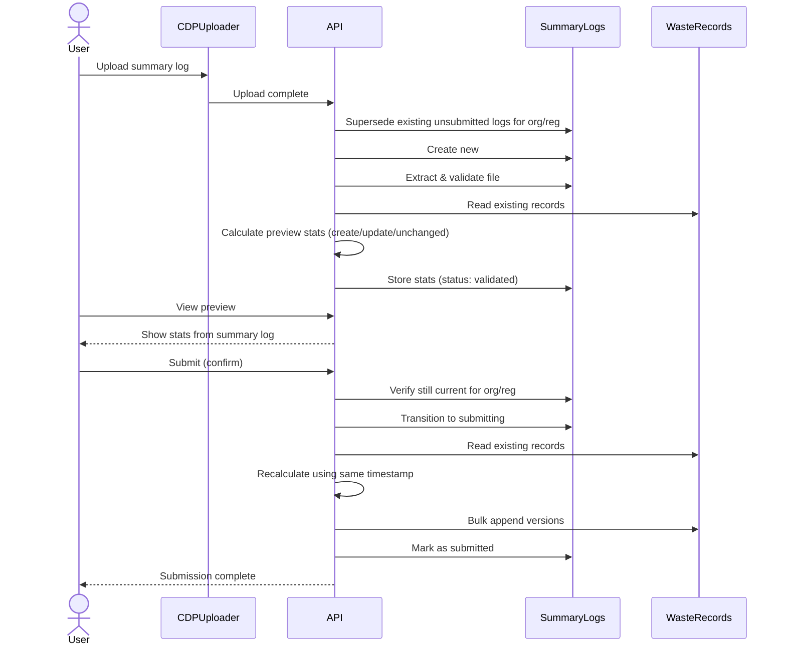
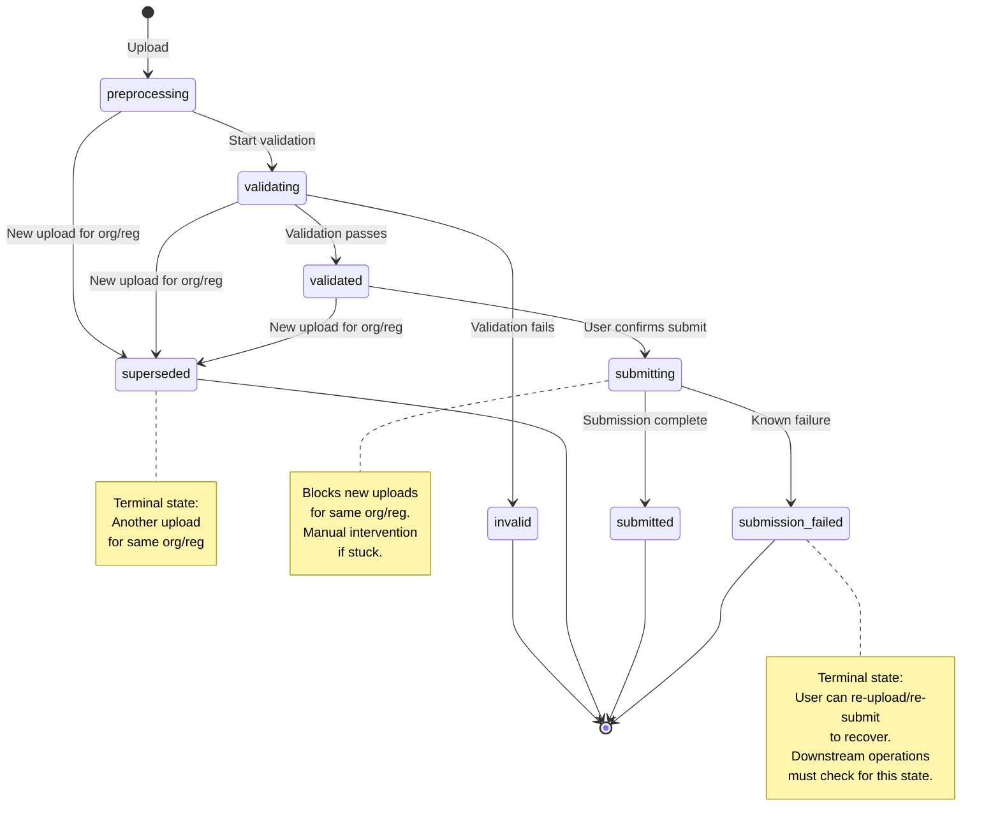
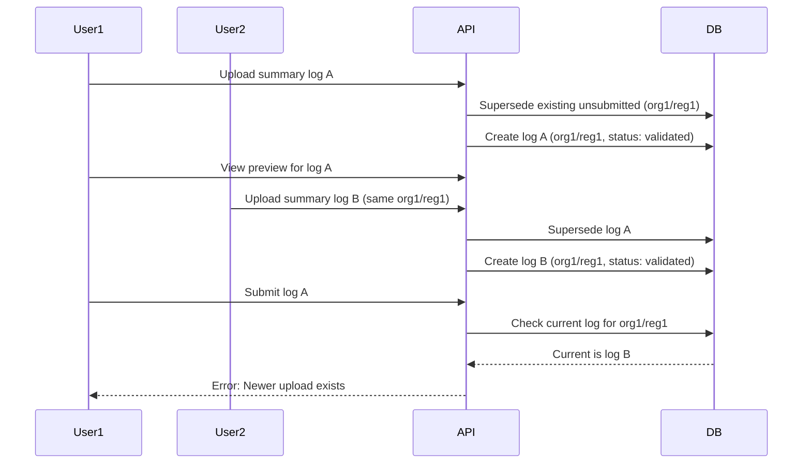
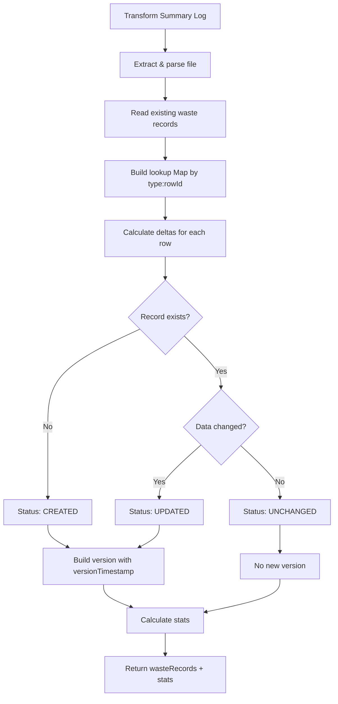
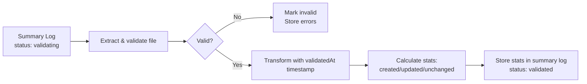
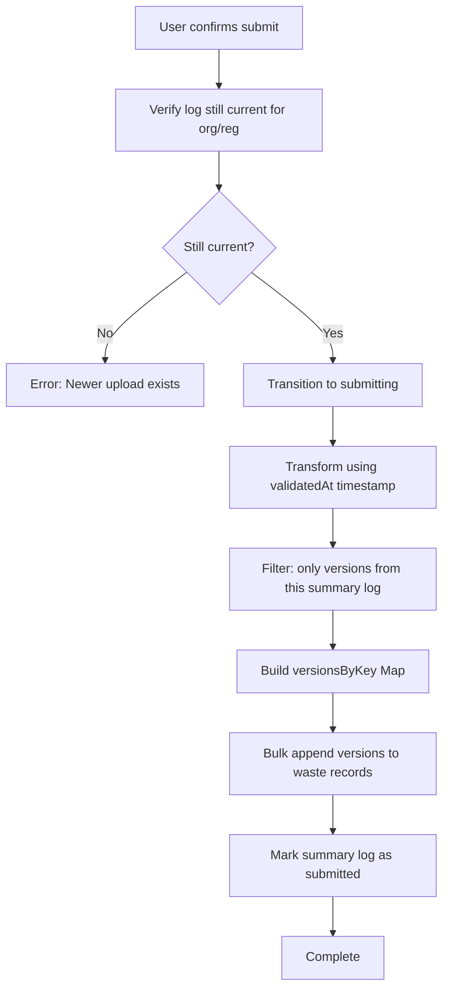

# Summary Log Submission: Low Level Design

This document describes the implementation approach for submitting summary logs with idempotent operations and retry mechanisms.

For the architectural decision and rationale, see [ADR 21: Idempotent Operations and Retry Mechanisms for Resilient Data Processing](../decisions/0021-idempotent-operations-and-retry-mechanisms.md).

<!-- prettier-ignore-start -->
<!-- TOC -->
- [Summary Log Submission: Low Level Design](#summary-log-submission-low-level-design)
  - [Project scope](#project-scope)
    - [Functional requirements](#functional-requirements)
    - [Non-functional requirements](#non-functional-requirements)
  - [Technical approach](#technical-approach)
    - [Overall workflow](#overall-workflow)
    - [Summary log status transitions](#summary-log-status-transitions)
    - [Organisation/registration level constraint](#organisationregistration-level-constraint)
    - [Repository port design](#repository-port-design)
    - [Shared transformation logic](#shared-transformation-logic)
    - [Validation phase](#validation-phase)
    - [Submission phase](#submission-phase)
    - [MongoDB adapter implementation](#mongodb-adapter-implementation)
  - [Incremental delivery](#incremental-delivery)
    - [Phase 1: Core submission (MVP)](#phase-1-core-submission-mvp)
    - [Phase 2: Robust retry mechanism](#phase-2-robust-retry-mechanism)
    - [Phase 3: Detectable failure handling](#phase-3-detectable-failure-handling)
    - [Recommended approach](#recommended-approach)
<!-- TOC -->

<!-- prettier-ignore-end -->

## Project scope

### Functional requirements

1. Accept summary log uploads containing up to 15,000 waste records
2. Validate uploaded data and calculate preview statistics (created/updated/unchanged records) and summary
3. Allow users to review preview before confirming submission
4. Submit validated data by appending new versions to waste record version history
5. Handle or prevent concurrent submissions for the same organisation/registration pair
6. Prevent stale previews when new uploads supersede previous ones

### Non-functional requirements

1. **Scale**: Process up to 15,000 waste records per summary log
2. **Performance**: Complete submission within reasonable time
3. **Consistency**: Avoid ambiguous state in production to reduce need for accessing sensitive data during investigation
4. **Resilience**: Recover from partial failures through idempotent retry mechanisms
5. **Operational clarity**: Clear status transitions and error states for support investigation
6. **MongoDB constraints**: Work within 16MB transaction size limit and 60 second transaction time limit

## Technical approach

### Overall workflow



### Summary log status transitions



### Organisation/registration level constraint

The system enforces that only one active summary log can exist per organisation/registration pair. Uploads are blocked during submission, and "last upload wins" for unsubmitted logs.



**Key operations:**

On upload, check for active submission and supersede unsubmitted logs:

```javascript
// 1. Block if submission in progress
const submitting = await findOne({
  organisationId,
  registrationId,
  status: 'submitting'
})
if (submitting) {
  throw Boom.conflict('A submission is in progress. Please wait.')
}

// 2. Supersede unsubmitted logs
status: { $in: ['preprocessing', 'validating', 'validated'] }
  → status: 'superseded'
```

On submit, verify still current:

```javascript
// Ensure this log is still the current validated one
if (currentValidatedLog.id !== submittedLogId) {
  throw Boom.conflict('A newer summary log has been uploaded')
}
```

**Rationale:**

- Blocks uploads during submission to prevent partial data from superseded logs
- Last upload wins for unsubmitted logs - simple mental model
- Eliminates stale preview problem entirely
- Clear error messages guide users

### Repository port design

The waste records repository provides a focused interface:

```javascript
interface WasteRecordsRepository {
  // Read all waste records for an organisation/registration
  findByRegistration(organisationId, registrationId): Promise<WasteRecord[]>

  // Append versions in bulk (Map keyed by "type:rowId")
  appendVersions(organisationId, registrationId, accreditationId,
                 versionsByKey: Map<string, VersionAppend>): Promise<void>
}
```

**Rationale:**

- Application layer: business logic (delta calculation, change detection)
- Repository layer: persistence (version appending, bulk operations)
- Single Map parameter groups all updates for one org/registration batch
- Map key `"type:rowId"` handles multiple waste record types in one summary log

### Shared transformation logic

Both validation and submission use identical transformation logic to ensure deterministic results.



**Rationale:**

- Single source of truth for transformation logic
- Both phases use identical code path - no divergence possible
- Reusing `validatedAt` timestamp keeps times consistent across rows
- Returns both waste records (for submission) and stats (for preview)
- Recalculation prevents possiblity of partially-stored preview data

### Validation phase

During validation, calculate preview statistics and summary for user review:



**Key points:**

- Preview stats stored in summary log: `{ previewStats: { created: 1234, updated: 567, unchanged: 89, ... } }`
- Full waste records NOT stored (would exceed 16MB for 15k records, or could be partially stored if split up)
- User views preview page showing the stored `previewStats`

### Submission phase

After user confirms preview, persist the changes:



**Key points:**

- Uses same transformation logic as validation phase
- Reuses `validatedAt` timestamp for consistent times across rows
- Org/reg constraint check prevents stale submissions
- Bulk operation handles up to 15k records efficiently
- On failure, leaves in 'submitting' state for recovery

**Idempotency implementation:**

```javascript
// Before appending version, check if it already exists
const existingVersionFromThisSummaryLog = wasteRecord.versions.find(
  v => v.summaryLogId === currentSummaryLog.id
)

if (existingVersionFromThisSummaryLog) {
  // Skip - already processed
  continue
}

// Otherwise, append the new version
versionsByKey.set(`${type}:${rowId}`, {
  data: newData,
  version: {
    summaryLogId: currentSummaryLog.id,
    versionTimestamp: currentSummaryLog.validatedAt,
    // ... other version fields
  }
})
```

### MongoDB adapter implementation

The MongoDB adapter uses bulk operations for efficient version appending:

```javascript
// For each waste record in versionsByKey Map:
{
  updateOne: {
    filter: { _compositeKey: "org:reg:type:rowId" },
    update: {
      $setOnInsert: { /* static fields (only on create) */ },
      $set: { data: currentData },
      $push: { versions: version }
    },
    upsert: true
  }
}

// Execute with: bulkWrite(ops, { ordered: false })
```

**Key MongoDB operations:**

- `$setOnInsert`: Static fields only when creating new document
- `$set`: Update top-level data on every operation
- `$push`: Append version to versions array
- `upsert: true`: Create document if doesn't exist
- `ordered: false`: Continue processing if one operation fails

**Implementation notes:**

1. Reusing `validatedAt` timestamp keeps version timestamps consistent across all rows
2. The `versions` array in waste records naturally supports idempotency via `summaryLog.id` checking
3. Preview stats stored in summary log: `{ previewStats: { created: 1234, updated: 567, unchanged: 89 } }`
4. Idempotency check happens in application layer before building the Map (avoids unnecessary writes)
5. Map key format `"type:rowId"` naturally groups versions by waste record
6. New uploads must supersede existing unsubmitted summary logs for the same org/reg
7. Submit must verify the summary log is still current before processing
8. The `superseded` status is a terminal state (no further transitions allowed)
9. If memory usage becomes a concern with >15k records, batch the Map building and multiple `appendVersions` calls

## Incremental delivery

### Phase 1: Core submission (MVP)

**Goal**: Deliver basic submission workflow with clear error states

**Scope**:

- Org/reg level locking to prevent concurrent submissions
- Two-phase workflow (validate/preview + submit)
- Idempotent version appending
- Summary log status transitions: `preprocessing` → `validating` → `validated` → `submitting` → `submitted`
- `superseded` state for uploads that are replaced
- Manual recovery for stuck submissions (left in `submitting` state)

**Benefits**:

- Eliminates stale preview problem
- Prevents race conditions
- Handles 15k+ records efficiently
- Safe retry on failure

**Limitations**:

- All errors require manual intervention
- No distinction between failure types
- No automated recovery

**Delivery risk**: Low - well-defined scope, no external dependencies

---

### Phase 2: Robust retry mechanism

**Goal**: Handle transient failures automatically

**Scope**:

- Add message queue for submission processing
- Implement retry logic with exponential backoff
- Dead Letter Queue (DLQ) for exhausted retries
- Monitoring and alerting for DLQ items

**Benefits**:

- Automatic recovery for transient failures
- Reduced manual intervention
- Better visibility into failure patterns
- No domain changes - purely infrastructure enhancement

**Dependencies**:

- Phase 1 complete
- Queue infrastructure provisioned

**Delivery risk**: Medium - additional infrastructure complexity, but no domain changes

---

### Phase 3: Detectable failure handling

**Goal**: Enable user self-service recovery for detectable failures

**Scope**:

- Add `submission_failed` terminal state
- Transition to `submission_failed` for detectable failures where we can update the summary log state
- Distinct from infrastructure failures (e.g. MongoDB connectivity issues) that leave the log stuck in `submitting`
- Clear error messages to guide user to re-upload/re-submit
- Update downstream operations to check for `submission_failed` state

**Benefits**:

- Minimal - persistent failures are unlikely to be fixable by users, and transient failures are handled in Phase 2
- Improved UX - users can fix and retry themselves
- Reduced support burden for detectable failure scenarios
- Better operational clarity (stuck in `submitting` vs marked as `submission_failed`)

**Dependencies**:

- Phase 1 complete
- Downstream operations updated (e.g. PRN issuance checks)

**Delivery risk**: Low - clear scope, but requires coordination with downstream operations

---

### Recommended approach

1. **Start with Phase 1** - delivers core value, low risk
2. **Implement Phase 2 (Queue)** - purely infrastructure, no domain changes, handles transient failures and automatic retries
3. **Evaluate Phase 3 based on data**:
   - If unfixable, detectable failures are common and causing support burden → implement `submission_failed` state
   - Phase 3 can be skipped if most failures are transient (handled by Phase 2)

**Note**: Phase 2 and Phase 3 are independent and could be delivered in parallel if desired. Phase 2 is simpler (infrastructure only) whilst Phase 3 requires coordination with downstream operations.

This approach balances delivering value early whilst learning from production behaviour before committing to complex recovery mechanisms.
