# Forms data logical data model

This is discussing logical data model for `Organisation`, `Registration`, `Accreditation` data submitted through forms.

## LDM

```mermaid
erDiagram
  Organization {
    string orgId PK "Primary identifier"
    string systemReference "_id from form submission Organization schema"
    int schemarVersion
    int version "Version of the document"
    array wasteOperations "Enum: Reprocessor, Exporter"
    array reprocessingNations "Enum: UK nations, international countries"
    string businessType "Enum: individual, unincorporated, partnership"
    object companyDetails "Company details"
    object partnership "Partnership details"
    object contactDetails "Contact details submitted in the form"
    array registrations
    array accreditations
    array formSubmissionRawDataIds
  }

  %% (Optional) If needed for auditing can be populated using change streams
  Organization_History {
  }

  FormSubmissions{
    string id
    object rawFormData
  }

  Registration {
    int id "id generated from counter keyed by year,siteAddress(can be null for exporters),material,processingType,form submission time"
    string formSubmissionTime
    string status
    object siteAddress "applicable only for reprocessor"
    string material "Enum:Aluminium,Fibre,Glass,Paper,Plastic,Steel,Wood"
    string processingType "Enum: Reprocessor, Exporter"
    string gridReference "applicable only for reprocessor"
    array recylingProcess "Enum:Glass re-melt,Glass other"
    object noticeAddress
    string wasteRegistrationNumber
    array wasteManagementPermits
    array approvedPersons
    string suppliers "applicable only for exporter"
    array exportPorts "applicable only for exporter"
    array yearlyMetrics "applicable only for reprocessor"
    string plantEquipmentDetails "applicable only for reprocessor"
    object contactDetails
    object submitterContactDetails
    array samplingInspectionPlan "list of references to documents"
    array overseasSites "list of references to documents. applicable only for exporters"
    array formSubmissionRawDataIds
  }

  Accreditation {
    int id "id generated from counter keyed by year,siteAddress(can be null for exporters),material,processingType,form submission time"
    string formSubmissionTime
    object siteAddress "applicable only for reprocessor"
    string material "Enum:Aluminium,Fibre,Glass,Paper,Plastic,Steel,Wood"
    string processingType "Enum: Reprocessor, Exporter"
    string status
    string registrationId "this could be automatically linked by default or manually provided from admin UI"
    object prnIssuance
    array businessPlan "object(description|detailedDescription|percentSpent)"
    object contactDetails
    object submitterContactDetails
    array samplingInspectionPlan "list of references to documents"
    array overseasSites "list of references to documents. applicable only for exporters"
    array formSubmissionRawDataIds
  }

  PrnIssuance {
    string plannedIssuance
    object signatories
    object prnIncomeBusinessPlan "array(percentIncomeSpent|usageDescription|detailedExplanation)"
  }

  YearlyMetrics {
    string year
    object input "type(actual|estimated)|ukPackagingWaste|nonUkPackagingWaste|nonPackagingWaste"
    array rawMaterailInputs "material|tonnage"
    object output "type(actual|estimated)|sentToAnotherSite|contaminants|processLoss"
    string metric "tonnage default"
    array productsMadeFromRecyling "name|weight"
  }

  WasteManagementPermit {
    string type "Enum: WML,PPC,Waste exemption"
    string permitNumber
    array exemptions "WasteExemption type"
    string authroisedWeight "in tonnes"
    string permitWindow "Enum: weekly, monthly, yearly"
  }

  WasteExemption {
    string reference
    string exemptionCode
  }

  CompanyDetails {
    string name "Official company name"
    string tradingName "Trading name if different"
    string registrationNumber "Companies House number"
    object registeredAddress
  }

  Partnership {
    string type "ltd,ltd_liability"
    array partners "Partner type"
  }

  Partner {
    string name
    enum type "Enum:company,individual"
  }

  Address {
    string line1 "Address line 1"
    string line2 "Address line 2 (optional)"
    string town "Town or city"
    string county
    string country "Country (default: UK)"
    string postcode "Postal code"
    string region "State/region for non-UK"
    string fullAddress "If it cant be parsed"
    string line2ToCounty "If it cant be parsed"
  }

  User {
    string fullName
    string email
    string phone
    string role
    string title
  }

  LoginDetails{
    string defra_id PK
    string email UK
  }

  Organization ||--o| CompanyDetails: "embeds_company_details"
  Organization ||--o| Partnership: "embeds_partnership_details"
  Organization ||--o| User: "embeds_contact_details"
  CompanyDetails ||--o| Address: "embeds_registered_address"
  Partnership ||--o{ Partner: "contains_partners"
  Registration ||--|| Address: "embeds_site_address"
  Accreditation ||--|| Address: "embeds_site_address"
  Organization ||--o{ Registration: "contains_registrations"
  Organization ||--o{ Accreditation: "contains__accreditations"
  Registration ||--|| User: "embeds_registration_contact_details"
  Registration ||--|| User: "embeds_registration_submitter_details"
  Accreditation ||--|| User: "embeds_accreditation_submitter_details"
  Registration ||--o{ WasteManagementPermit: "contains_waste_permits"
  WasteManagementPermit ||--o{ WasteExemption: "contains_exemptions"
  Registration ||--o| YearlyMetrics: "embeds_yearly_metrics"
  Registration ||--o| PrnIssuance: "embeds_prn_issuance"

  Organization ||--o{ Organization_History: "contains_list_of_changes"

  Organization ||--|| FormSubmissions: "linked_to_form_submission"
  Registration ||--|| FormSubmissions: "linked_to_form_submission"
  Accreditation ||--|| FormSubmissions: "linked_to_form_submission"

  %% Whether to model users as separate collection with foreign key or embedded one needs to be explored
  Registration ||--o{ User: "contains_approved_persons"
  PrnIssuance ||--o{ User: "contains_signatories"

  User ||--o| LoginDetails: "has_defra_id"

```



## Mocked up date

### where registration and accreditation ids match

```
{
  "_id": "50002",
  "orgId": "50002",
  "schemaVersion": 1,
  "version": 1,
  "reprocessingNations": ["England", "Wales"],
  "businessType": "Partnership",
  "registrations": [
    {
      "id": 2,
      "status": "created",
      "formSubmissionTime": "2025-08-20T19:34:44.944Z",
      "siteAddress": {
        "line1": "7 Glass processing site",
        "town": "London",
        "postcode": "SW2A 0AA"
      },
      "material": "Glass",
      "processingType": "Reprocessor",
      "gridReference": "123455",
      "wasteRegistrationNumber": "CBDU123456",
      "wasteManagementPermits": [
        {
          "type": "WML",
          "permitNumber": "WML123456",
          "authroisedWeight": "10",
          "permitWindow": "yearly"
        }
      ],
      "approvedPersons": [
        {
          "fullName": "Luke Skywalker",
          "email": "luke.skywalker@starwars.com",
          "title": "Director",
          "phone": "1234567890"
        }
      ],
      "noticeAddress": {
        "line1": "7 Glass processing site",
        "town": "London",
        "postcode": "SW2A 0AA"
      }
    },
    {
      "id": 3,
      "status": "created",
      "formSubmissionTime": "2025-08-21T19:34:44.944Z",
      "material": "Plastic",
      "processingType": "Exporter",
      "wasteRegistrationNumber": "CBDU123456",
      "wasteManagementPermits": [
        {
          "type": "WML",
          "permitNumber": "WML123456",
          "authroisedWeight": "10",
          "permitWindow": "yearly"
        }
      ],
      "approvedPersons": [
        {
          "fullName": "Luke Skywalker",
          "email": "anakin.skywalker@starwars.com",
          "title": "Partner",
          "phone": "823456789"
        }
      ],
      "noticeAddress": {
        "line1": "7 Glass processing site",
        "town": "London",
        "postcode": "SW2A 0AA"
      }
    }
  ],
  "accreditations": [
    {
      "id": 1,
      "registrationId": 2,
      "formSubmissionTime": "2025-08-20T21:34:44.944Z",
      "status": "created",
      "siteAddress": {
        "line1": "7 Glass processing site",
        "postcode": "SW2A 0AA"
      },
      "material": "Glass",
      "processingType": "Reprocessor",
      "prnIssuance": {
        "plannedIssuance": "10000 tonnes",
        "prnIncomeBusinessPlan": [
          {
            "description": "New reprocessing infrastructure and maintaining existing infrastructure",
            "detailedDescription": "Investing on buying to machine to separate glass from waste",
            "percentSpent": 20
          }
        ]
      },
      "signatories": [
        {
          "fullName": "Yoda",
          "email": "toda@starwars.com",
          "title": "PRN signatory",
          "phone": "1234567890"
        }
      ],
      "noticeAddress": {
        "line1": "7 Glass processing site",
        "town": "London",
        "postcode": "SW2A 0AA"
      }
    },
    {
      "id": 2,
      "registrationId": null,
      "status": "created",
      "siteAddress": {
        "line1": "7",
        "postcode": "SW2A 0AA"
      },
      "material": "Glass",
      "processingType": "Reprocessor",
      "prnIssuance": {
        "plannedIssuance": "10000 tonnes",
        "prnIncomeBusinessPlan": [
          {
            "description": "New reprocessing infrastructure and maintaining existing infrastructure",
            "detailedDescription": "Investing on buying to machine to separate glass from waste",
            "percentSpent": 20
          }
        ]
      },
      "signatories": [
        {
          "fullName": "Yoda",
          "email": "yoda@starwars.com",
          "title": "PRN signatory",
          "phone": "1234567890"
        }
      ],
      "noticeAddress": {
        "line1": "7a",
        "town": "London",
        "postcode": "SW2A 0AA"
      }
    },
    {
      "id": 3,
      "registrationId": 3,
      "status": "created",
      "material": "Plastic",
      "processingType": "Exporter",
      "prnIssuance": {
        "plannedIssuance": "300 tonnes",
        "prnIncomeBusinessPlan": [
          {
            "description": "New vehicle to transport",
            "percentSpent": 10
          }
        ]
      },
      "signatories": [
        {
          "fullName": "Princess Leia",
          "email": "princess.leia@starwars.com",
          "title": "PRN signatory",
          "phone": "7234567890"
        }
      ],
      "noticeAddress": {
        "line1": "7a",
        "town": "London",
        "postcode": "SW2A 0AA"
      }
    }
  ],
  "companyDetails": {
    "name": "ACME ltd",
    "tradingName": "ACME ltd",
    "registrationNumber": "AC012345",
    "registeredAddress": {
      "line1": "Palace of Westminster",
      "town": "London",
      "postcode": "SW1A 0AA"
    }
  }
}
```

## Physical data model

Before deciding physical data model will be useful to answer below questions and then quick POC options

### Domain model constraints
- Organisations that has sites at more than one nation do they register organisation once or multiple times with each regulator. do they use single organisation form and then the single orgId to register for all sites? Any validations should be done to make sure duplicate org ids for same organaisations?
- Exporter registration form is not required to provide site address(only notice address) while filling form, so they just export from ports and dont have their own sites to collect wastes?.
- Reprocessing sites can be identified by first line of address and postcode?. The registration and accreditation needs to be matched to be part of same object as registration is prerequisite for accreditation.During accreditation only first line of address and postcode is provided.
- Registration needs to be renewed every year, accreditation needs to be applied every year. Do we automatically mark all registrations/accreditations as expired at certain date next year if not renewed? Also during renewal probably they are allowed to update details, dont know how this works. Not an immediate concern.
- Material can be identified by wasteCategory and processing type(reprocessor or exporter) and site address(reprocessor)?. Should this be called as WasteOperations instead of material
- Enforcing uniqueness for orgId, site address and material within an org. Either at db or application level
- Validating accreditation is referencing valid registration id needs to be ensured at application level during CRUD operations.
- Parsing of address could be tricky with optional fields, might have to resort to store what could not be parsed clearly as single field(UK and non UK) or whole thing as single line worst case(non UK address).
- Does data need to de-duplicated across forms? let's say an org has a site that does reprocessing and exporting, or a site that processes multiple materials. It might provide same permit details, system reference and permittedMaterials across forms. IMO better to store them separately and be able to query/show as well instead of de-duping but want to confirm.
- Users can be identified by email.id? This is relevant when regulator approves and defra id needs to be created and emailed to them. The lineage between defra and email id needs to be stored separately if they are different

### Query patterns

To decide what indexes are needed and drive physical model

- Get all organisations|sites|materials for logged in approved/designated approved user
- Searching by site address or orgId.
- Should regulators be able to search only organisations that has sites in their nations
- Does regulators need to query registrations/accreditations by status? e.g pending ones
- Query all sites by particular material?
- Query all sites by prn allowance?
- Query all sites by certain prn allowance?
