# Forms data logical data model

There is a set of forms provided to users as part of a contingency solution to apply for registration and accreditations.

This describes logical data model for storing data collected though forms for `organisation`, `registration`, `accreditation`

### Test env form urls

- [Organisation details](https://forms-runner.test.cdp-int.defra.cloud/form/preview/draft/demo-for-pepr-extended-producer-responsibilities-provide-your-organisation-details-ea/form-guidance)
- [Exporter registration](https://forms-runner.test.cdp-int.defra.cloud/form/preview/draft/demo-for-pepr-extended-producer-responsibilities-register-as-a-packaging-waste-exporter-ea/form-guidance)
- [Reprocessor registration](https://forms-runner.test.cdp-int.defra.cloud/form/preview/draft/demo-for-pepr-extended-producer-responsibilities-register-as-a-packaging-waste-reprocessor-ea/form-guidance)
- [Exporter accreditation](https://forms-runner.test.cdp-int.defra.cloud/form/preview/draft/demo-for-pepr-extended-producer-responsibilities-apply-for-accreditation-as-a-packaging-waste-exporter-ea/form-guidance)
- [Reprocessor accreditation](https://forms-runner.test.cdp-int.defra.cloud/form/preview/draft/demo-for-pepr-extended-producer-responsibilities-apply-for-accreditation-as-a-packaging-waste-reprocessor-ea/form-guidance)

## LDM

```mermaid
erDiagram
  Organisation {
    string _id "systemReference from organisation form submission"
    string orgId PK "unique identifier"
    int schemaVersion
    int version "Version of the document. incremented during write and can be used for optimistic locking in future"
    array wasteProcessingTypes "Enum: reprocessor, exporter"
    array reprocessingNations "Enum: england,wales, scotland,northern_ireland"
    string businessType "Enum: individual, unincorporated, partnership"
    object companyDetails "Company details"
    object partnership "Partnership details"
    object contactDetails "Contact details submitted in the form"
    array registrations
    array accreditations
    string formSubmissionRawDataId
  }

  %% (Optional) If needed for auditing can be populated using change streams
  Organisation_History {
  }

  FormSubmissions{
    string id
    object rawFormData
  }

  Registration {
    int id "ObjectId"
    string formSubmissionTime
    string status
    object siteAddress "applicable only for reprocessor"
    string material "Enum:aluminium,fibre,glass,paper,plastic,steel,wood"
    string wasteProcessingType "Enum: reprocessor, exporter. This might need to be parsed from form name or another field"
    string accreditationId "automatically linked when possible"
    string gridReference "applicable only for reprocessor"
    array recylingProcess "Enum:glass_re_melt,glass_other"
    object noticeAddress
    string wasteRegistrationNumber
    array wasteManagementPermits
    array approvedPersons
    string suppliers "applicable only for exporter"
    array exportPorts "applicable only for exporter"
    array yearlyMetrics "applicable only for reprocessor"
    string plantEquipmentDetails "applicable only for reprocessor"
    object contactDetails
    object submitterContactDetails
    array samplingInspectionPlan "list of references to documents"
    array overseasSites "list of references to documents. applicable only for exporters"
    string formSubmissionRawDataId
  }

  Accreditation {
    int id "ObjectId"
    string formSubmissionTime
    object siteAddress "applicable only for reprocessor"
    string material "Enum: aluminium,fibre,glass,paper,plastic,steel,wood"
    string wasteProcessingType "Enum: reprocessor, exporter"
    string status
    object prnIssuance
    array businessPlan "object(description|detailedDescription|percentSpent)"
    object contactDetails
    object submitterContactDetails
    array samplingInspectionPlan "list of references to documents"
    array overseasSites "list of references to documents. applicable only for exporters"
    string formSubmissionRawDataId
  }

  PrnIssuance {
    string plannedIssuance
    object signatories
    object prnIncomeBusinessPlan "array(percentIncomeSpent|usageDescription|detailedExplanation)"
  }

  YearlyMetrics {
    string year
    object input "type(actual|estimated)|ukPackagingWaste|nonUkPackagingWaste|nonPackagingWaste"
    array rawMaterailInputs "material|tonnage"
    object output "type(actual|estimated)|sentToAnotherSite|contaminants|processLoss"
    string metric "tonnage default"
    array productsMadeFromRecyling "name|weight"
  }

  WasteManagementPermit {
    string type "Enum: wmlL,ppc,waste_exemption"
    string permitNumber
    array exemptions "WasteExemption type"
    string authorisedWeight "in tonnes"
    string permitWindow "Enum: weekly, monthly, yearly"
  }

  WasteExemption {
    string reference
    string exemptionCode
  }

  CompanyDetails {
    string name "Official company name"
    string tradingName "Trading name if different"
    string registrationNumber "Companies House number"
    object registeredAddress
  }

  Partnership {
    string type "ltd,ltd_liability"
    array partners "Partner type"
  }

  Partner {
    string name
    enum type "Enum:company,individual"
  }

  Address {
    string line1 "Address line 1"
    string line2 "Address line 2 (optional)"
    string town "Town or city"
    string county
    string country "Country (default: UK)"
    string postcode "Postal code"
    string region "State/region for non-UK"
    string fullAddress "If it cant be parsed"
    string line2ToCounty "If it cant be parsed"
  }

  User {
    string fullName
    string email
    string phone
    string role
    string title
  }

  LoginDetails{
    string defra_id PK
    string email UK
  }

  Organisation ||--o| CompanyDetails: "embeds_company_details"
  Organisation ||--o| Partnership: "embeds_partnership_details"
  Organisation ||--o| User: "embeds_contact_details"
  CompanyDetails ||--o| Address: "embeds_registered_address"
  Partnership ||--o{ Partner: "contains_partners"
  Registration ||--|| Address: "embeds_site_address"
  Accreditation ||--|| Address: "embeds_site_address"
  Organisation ||--o{ Registration: "contains_registrations"
  Organisation ||--o{ Accreditation: "contains__accreditations"
  Registration ||--|| User: "embeds_registration_contact_details"
  Registration ||--|| User: "embeds_registration_submitter_details"
  Accreditation ||--|| User: "embeds_accreditation_submitter_details"
  Registration ||--o{ WasteManagementPermit: "contains_waste_permits"
  WasteManagementPermit ||--o{ WasteExemption: "contains_exemptions"
  Registration ||--o| YearlyMetrics: "embeds_yearly_metrics"
  Registration ||--o| PrnIssuance: "embeds_prn_issuance"

  Organisation ||--o{ Organisation_History: "contains_list_of_changes"

  Organisation ||--|| FormSubmissions: "linked_to_form_submission"
  Registration ||--|| FormSubmissions: "linked_to_form_submission"
  Accreditation ||--|| FormSubmissions: "linked_to_form_submission"

  %% Whether to model users as separate collection with foreign key or embedded one needs to be explored
  Registration ||--o{ User: "contains_approved_persons"
  PrnIssuance ||--o{ User: "contains_signatories"

  User ||--o| LoginDetails: "has_defra_id"

```



### Example data using LDM

```
{
  "_id": "6507f1f77bcf86cd79943901",
  "orgId": "50002",
  "schemaVersion": 1,
  "version": 1,
  "reprocessingNations": ["england", "wales"],
  "businessType": "partnership",
  "registrations": [
    {
      "id": 2,
      "status": "created",
      "formSubmissionTime": "2025-08-20T19:34:44.944Z",
      "siteAddress": {
        "line1": "7 Glass processing site",
        "town": "London",
        "postcode": "SW2A 0AA"
      },
      "material": "glass",
      "wasteProcessingType": "reprocessor",
      "accreditationId": "04de8fb2-2dab-48ad-a203-30a80f595c0b"
      "gridReference": "123455",
      "wasteRegistrationNumber": "CBDU123456",
      "wasteManagementPermits": [
        {
          "type": "wml",
          "permitNumber": "WML123456",
          "authroisedWeight": "10",
          "permitWindow": "yearly"
        }
      ],
      "approvedPersons": [
        {
          "fullName": "Luke Skywalker",
          "email": "luke.skywalker@starwars.com",
          "title": "Director",
          "phone": "1234567890"
        }
      ],
      "noticeAddress": {
        "line1": "7 Glass processing site",
        "town": "London",
        "postcode": "SW2A 0AA"
      }
    },
    {
      "id": "dc60a427-3bfa-4092-9282-bc533e4213f9",
      "status": "created",
      "formSubmissionTime": "2025-08-21T19:34:44.944Z",
      "material": "plastic",
      "wasteProcessingType": "exporter",
      "wasteRegistrationNumber": "CBDU123456",
      "wasteManagementPermits": [
        {
          "type": "wml",
          "permitNumber": "WML123456",
          "authroisedWeight": "10",
          "permitWindow": "yearly"
        }
      ],
      "approvedPersons": [
        {
          "fullName": "Luke Skywalker",
          "email": "anakin.skywalker@starwars.com",
          "title": "Partner",
          "phone": "823456789"
        }
      ],
      "noticeAddress": {
        "line1": "7 Glass processing site",
        "town": "London",
        "postcode": "SW2A 0AA"
      }
    }
  ],
  "accreditations": [
    {
      "id": "04de8fb2-2dab-48ad-a203-30a80f595c0b",
      "formSubmissionTime": "2025-08-20T21:34:44.944Z",
      "status": "created",
      "siteAddress": {
        "line1": "7 Glass processing site",
        "postcode": "SW2A 0AA"
      },
      "material": "glass",
      "wasteProcessingType": "reprocessor",
      "prnIssuance": {
        "plannedIssuance": "10000 tonnes",
        "prnIncomeBusinessPlan": [
          {
            "description": "New reprocessing infrastructure and maintaining existing infrastructure",
            "detailedDescription": "Investing on buying to machine to separate glass from waste",
            "percentSpent": 20
          }
        ]
      },
      "signatories": [
        {
          "fullName": "Yoda",
          "email": "toda@starwars.com",
          "title": "PRN signatory",
          "phone": "1234567890"
        }
      ],
      "noticeAddress": {
        "line1": "7 Glass processing site",
        "town": "London",
        "postcode": "SW2A 0AA"
      }
    },
    {
      "id": "26673c70-5f03-4865-a796-585ef4ddca30",
      "status": "created",
      "siteAddress": {
        "line1": "7",
        "postcode": "SW2A 0AA"
      },
      "material": "glass",
      "wasteProcessingType": "reprocessor",
      "prnIssuance": {
        "plannedIssuance": "10000 tonnes",
        "prnIncomeBusinessPlan": [
          {
            "description": "New reprocessing infrastructure and maintaining existing infrastructure",
            "detailedDescription": "Investing on buying to machine to separate glass from waste",
            "percentSpent": 20
          }
        ]
      },
      "signatories": [
        {
          "fullName": "Yoda",
          "email": "yoda@starwars.com",
          "title": "PRN signatory",
          "phone": "1234567890"
        }
      ],
      "noticeAddress": {
        "line1": "7a",
        "town": "London",
        "postcode": "SW2A 0AA"
      }
    },
    {
      "id": "dc60a427-3bfa-4092-9282-bc533e4213f9",
      "status": "created",
      "material": "plastic",
      "wasteProcessingType": "exporter",
      "prnIssuance": {
        "plannedIssuance": "300 tonnes",
        "prnIncomeBusinessPlan": [
          {
            "description": "New vehicle to transport",
            "percentSpent": 10
          }
        ]
      },
      "signatories": [
        {
          "fullName": "Princess Leia",
          "email": "princess.leia@starwars.com",
          "title": "PRN signatory",
          "phone": "7234567890"
        }
      ],
      "noticeAddress": {
        "line1": "7a",
        "town": "London",
        "postcode": "SW2A 0AA"
      }
    }
  ],
  "companyDetails": {
    "name": "ACME ltd",
    "tradingName": "ACME ltd",
    "registrationNumber": "AC012345",
    "registeredAddress": {
      "line1": "Palace of Westminster",
      "town": "London",
      "postcode": "SW1A 0AA"
    }
  }
}
```

## Converting forms data into logical data model

The data submitted from forms is stored in three MongoDB collections: `organisation`, `registration`, `accreditation`. It's stored as a list of answers from forms and raw submission data as JSON.

Example data from form submissions is available in [Sample form data](../../../src/data/fixtures/).

This data needs to be parsed and stored in the logical model proposed above:

- Fetch all submissions from the organisation collection. Parse required fields (company name, address, etc.)
- Parsing should take into account questions being worded slightly differently across different nation (England, Wales, Scotland, NI) forms
- For each organisation, fetch all registrations and accreditations using the referenceNumber
- Parse required fields from registrations and accreditations (material, site address, etc.). Whether the submission is for a reprocessor or exporter might have to be inferred from the form name
- Generate a unique id using ObjectId for each registration/accreditation
- Link registration ID to accreditation ID using "1st line of address, postcode, material, wasteProcessingType"

### ID generation for registration and accreditation

There were two options considered

1. Generate uuid from "site address, material, wasteProcessingType, form submission time". Form submission time is used to account for duplicate form submissions. This has the advantage of ensuring uniqueness at db level.
2. Generate a random unique id using ObjectId. At code level validation should be done to make sure duplicate ids are not generated for same registrations if form data is replayed.

Option #2 has been chosen as it makes it easy to evolve list of fields that constitute a unique registration

### Linking registrations to accreditations

There were two options considered for modelling registrations and accreditations:

1. Store both under a single WasteOperations object within the organisation. Waste operations are identified by combination of "material, reprocessor/exporter, site address (line1, postcode)". This means registration and accreditation for the same waste operation are stored together and easy to link. However, the problem is that users can submit slightly different data in registration/accreditation forms. For example, a user provides the first line of address as "171 street" during registration and during accreditation as "171". Users might also submit duplicate forms, in which case data has to be deduplicated.

2. Store registrations and accreditations as separate arrays under organisations. Generate a unique id for registration/accreditation using ObjectId. Automatically link registration to accreditation when "material, reprocessor/exporter, site address (line1, postcode)" matches. When it doesn't match, linking has to be resolved from the admin UI. There has to be logic to ensure any write operation doesn't leave registration to accreditation linkage invalid. For example, site address being updated in registration object.

Option 2 has been chosen as it handles users submitting slightly different data between registration/accreditation and duplicate submissions.

### Schema version

Schema changes will be versioned and stored at record level.

### Document version field

The version field will start from 1(insert) then get incremented for every update. It can be used for optimistic locking in future

### Auditing changes to organisation

**Info:** This is only a suggestion and needs to be discussed and agreed

There's no requirement to show changes to organisation data over time. However, it will be good to store history for auditing/debugging.
For summary log it has been decided to track changes over time as a field inside same record. This is a variation of [slowly changing dimension Type 3](https://en.wikipedia.org/wiki/Slowly_changing_dimension).

The proposal for organisation is to store the current version and historical versions in separate collections following [slowly changing dimension Type 4](https://en.wikipedia.org/wiki/Slowly_changing_dimension).
As organisation is complex nested structure easy to store full historic versions than working out what has changed
One option is write to organisation_history everytime there's an update to organisation using [MongoDB change streams](https://www.mongodb.com/docs/manual/changestreams/).

### Creating new collection

Existing collections won't be used once data is moved to new organisation_epr/form_submissions collection.
Create a new collection to store combined data from `organisation`, `registration`, `accreditation`. This means original data remain intact if needed.

As organisation collection name is already used, there are two options available

1. rename existing collections to `organisation_forms`, `registration_forms`, `accreditation_forms` and use organisation as new collection name.
   This can be down in straightforward manner with downtime. A bit more involved to deploy renaming without downtime
   One option is to deploy code change to fall back to new name if old name doesn't exist then deploy name change
2. Use organisation_epr, or another name for new collection

The rest of document assumes option#2 is being chosen as its less risky but this is not agreed yet.

### Flow diagram for converting to logical data model

```mermaid
flowchart TD
  subgraph FormsData ["Source Collections"]
    direction LR
    Organisation[(organisation)] ~~~ Registration[(registration)] ~~~ Accreditation[(accreditation)]
  end

  subgraph ProcessedFormData ["Processed Collections"]
    direction LR
    OrganisationEpr[(organisation_epr)] ~~~  OrganisationHistory[(organisation_history)] ~~~ FormSubmissions[(form_submissions)]
  end

  FormsData --> ForEach{"For each organisation"}

  ForEach ---> OrgData
  subgraph OrgData ["Parse organisation details"]
    direction TB
    E1[_id as org id in new collection] --> E2[parse company details like name, partnership, registrationNo etc..]
    E2 --> E3[parse contact details ]
    E3 --> E4[store raw form submission data in form_submissions collection and reference _id here]
  end

  subgraph RegistrationData ["Parse registration details"]
    direction TB
    E5[find registrations for given org referenceNumber] --> E6[from form answers infer its reprocessor/exporter]
    E6-->E7[get material type,site address]
    E7--> E8[generate registration id]
    E8 --> E9[store raw form submission data in form_submissions collection and reference _id here]
  end

  OrgData --> RegistrationData[Extract registration data]

  subgraph AccreditationData ["Parse accreditation details"]
    direction TB
    E10[find accreditations for given org referenceNumber] --> E11[from form answers infer its reprocessor/exporter]
    E11-->E12[get material type, site address]
    E12--> E13[generate accreditation id ]
    E13 --> E14[store raw form submission data in form_submissions collection and reference _id here]
    E14 --> E15[link registration to accreditation id using site address, material, processing type]
  end

  RegistrationData --> AccreditationData[Extract accreditation data]
  AccreditationData --> ProcessedOutput{"Store all processed org data in new collection"}
  ProcessedOutput --> ProcessedFormData[(Processed Data)]

```



## Assumptions

- System will not deduplicate data across form submissions. Logical data model will store data submitted as its from forms and then potentially update anything incorrect from admin UI.
- Registration needs to be renewed every year, accreditation needs to be applied every year. For now its assumed system is tracking current registration/accreditations and not storing for which year its applicable
- How to model users and their DEFRA logins needs to be investigated separately. Users can potentially be identified by email.id.
  This is relevant when regulator approves registration/accreditation and defra id needs to be created and emailed to them.
  The lineage between defra id and email id(or whatever is decided to link approved person/prn signatory to defra id) needs to be stored.
