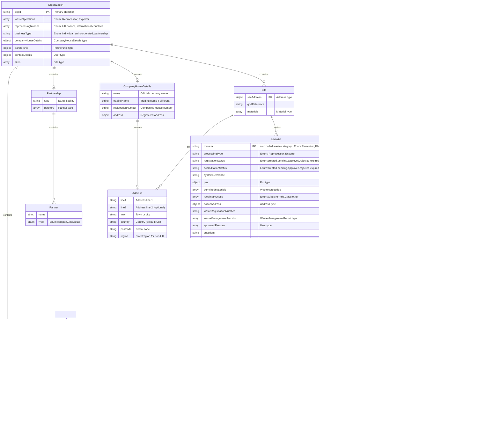

# Forms data logical data model

This is discussing logical data model for `Organisation`, `Registration`, `Accreditation` data submitted through forms.

## LDM

```mermaid
erDiagram
  Organization {
    string orgId PK "Primary identifier"
    array wasteOperations "Enum: Reprocessor, Exporter"
    array reprocessingNations "Enum: UK nations, international countries"
    string businessType "Enum: individual, unincorporated, partnership"
    object companyHouseDetails "CompanyHouseDetails type"
    object partnership "Partnership type"
    object contactDetails "User type"
    array sites "Site type"
  }

  Site {
    object siteAddress PK "Address type"
    string gridReference
    array materials "Material type"
      }

  Material{
    string material PK "also called waste category , Enum:Aluminium,Fibre,Glass,Paper,Plastic,Steel,Wood"
    string processingType "Enum: Reprocessor, Exporter"
    string registrationStatus "Enum:created,pending,approved,rejected,expired"
    string accreditationStatus "Enum:created,pending,approved,rejected,expired"
    string systemReference
    object prn "Prn type"
    array permittedMaterials "Waste categories"
    array recylingProcess "Enum:Glass re-melt,Glass other"
    object noticeAddress "Address type"
    string wasteRegistrationNumber
    array wasteManagementPermits "WasteManagementPermit type"
    array approvedPersons "User type"
    string suppliers
    array exportPorts
    array yearlyMetrics
    string plantEquipmentDetails
    object samplingInspectionPlan "array(part1),|array(part2)"
    object overseasSites "array(orsLog)"
    object registrationContactDetails "User"
    object registrationSubmitterContactDetails "User"
    object accreditationSubmitterContactDetails "User"
  }

  Prn {
    string plannedIssuance
    object signatories "User type"
    object prnIncomeBusinessPlan "array(percentIncomeSpent|usageDescription|detailedExplanation)"
  }

  YearlyMetrics {
    string year
    object input "type(actual|estimated)|ukPackagingWaste|nonUkPackagingWaste|nonPackagingWaste"
    array rawMaterailInputs "material|tonnage"
    object output "type(actual|estimated)|sentToAnotherSite|contaminants|processLoss"
    string metric "tonnage default"
    array productsMadeFromRecyling "name|weight"
  }

  WasteManagementPermit {
    string type "Enum: WML,PPC,Waste exemption"
    string permitNumber
    array exemptions "WasteExemption type"
    string authroisedWeight "in tonnes"
    string permiteTime "Enum: weekly, monthly, yearly"
  }

  WasteExemption {
    string reference
    string exemptionCode
  }

  CompanyHouseDetails {
    string name "Official company name"
    string tradingName "Trading name if different"
    string registrationNumber "Companies House number"
    object address "Registered address"
  }

  Partnership {
    string type "ltd,ltd_liability"
    array partners "Partner type"
  }

  Partner {
    string name
    enum type "Enum:company,individual"
  }

  Address {
    string line1 "Address line 1"
    string line2 "Address line 2 (optional)"
    string town "Town or city"
    string country "Country (default: UK)"
    string postcode "Postal code"
    string region "State/region for non-UK"
  }

  User {
    string fullName
    string email
    string phone
    string role
    string title
  }

  Organization ||--o| CompanyHouseDetails: contains
  Organization ||--o| Partnership: contains
  Organization ||--o| User: contains
  Organization ||--o{ Site: contains
  CompanyHouseDetails ||--o| Address: contains
  Partnership ||--o{ Partner: contains
  Site ||--o{ Address: contains
  Site ||--o{ Material: contains
  Material ||--o| User: contains
  Material ||--o{ WasteManagementPermit: contains
  WasteManagementPermit ||--o{ WasteExemption: contains
  Material ||--o| YearlyMetrics: contains
  Material ||--o| Prn: contains
  Material ||--o{ User: contains
  Prn ||--o{ User: contains
```

## Physical data model

Before deciding physical data model will be useful to answer below questions and then quick POC options

### Domain model questions

- Organisations that has sites at more than one nation do they register organisation once or multiple times with each regulator
- Site can be uniquely identified by first line of address and postcode? But exporters are not required to provide site address(only notice address) while filling form
- Material can be identified by material and reprocessor or exporter? But not sure if its good choice
- Users can be identified by email.id? This is relevant when regulator approves and defra id needs to be created and emailed to them. The lineage between defra and email id needs to be stored separately if they are different
- Registration needs to be renewed every year, accreditation needs to be applied every year. Do we automatically mark all registrations/accreditations as expired at certain date next year if not renewed? Also during renewal probably they are allowed to update details, dont know how this works. Not an immediate concern.
- Does data need to de-duplicated across forms? let's say an org has a site that does reprocessing and exporting, or a site that processes multiple materials. It might provide same permit details, system reference and permittedMaterials across forms. IMO better to store them separately and be able to query/show as well instead of de-duping but want to confirm.
- Enforcing unique key for orgId, site address and material within an org. Either at db or application level
- Parsing of address could be tricky with optional fields, might have to resort to adding fields that store what could not be parsed clearly(UK and non UK) or whole thing as single line worst case(non UK address).

### Query patterns

To decide what indexes are needed and drive physical model

- Get all organisations|sites|materials for logged in approved/designated approved user
- Searching by site address or orgId or systemReference.
- Should regulators be able to search only organisations that has sites in their nations
- Does regulators need to query registrations/accreditations by status? e.g pending ones
- Query all sites by particular material?
- Query all sites by prn allowance?
- Query all sites by certain prn allowance?

### NFR

- How many organisations
- How many sites
- Materials i.e worst case can assume 3 times #sites
- Performance expectations for above queries
- Max parallel write/queries
- any mongo limitations on number of indexes, UK within nested objects etc...
