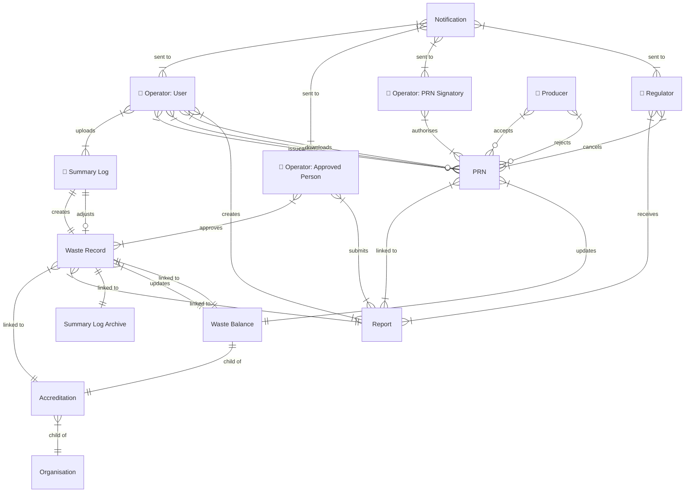
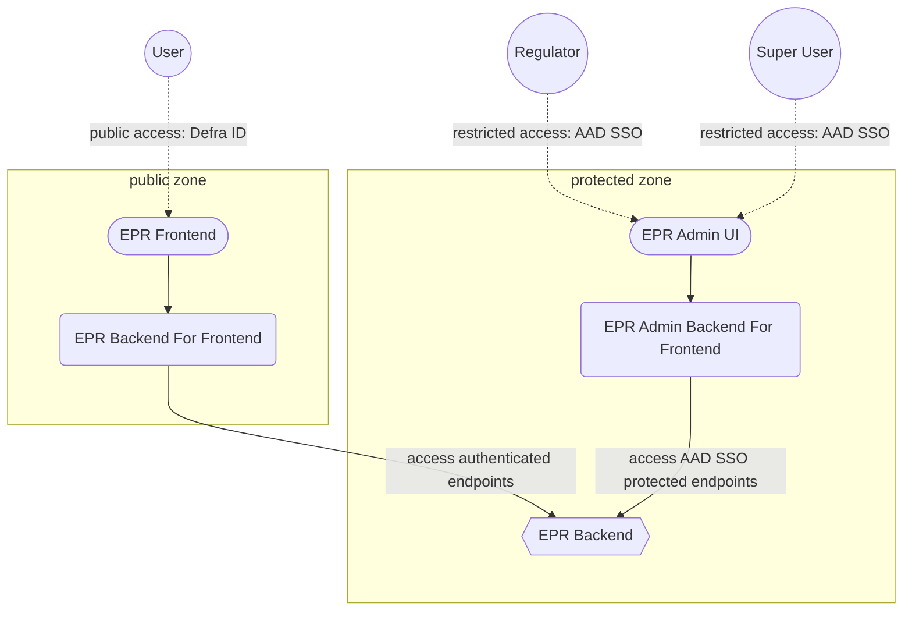
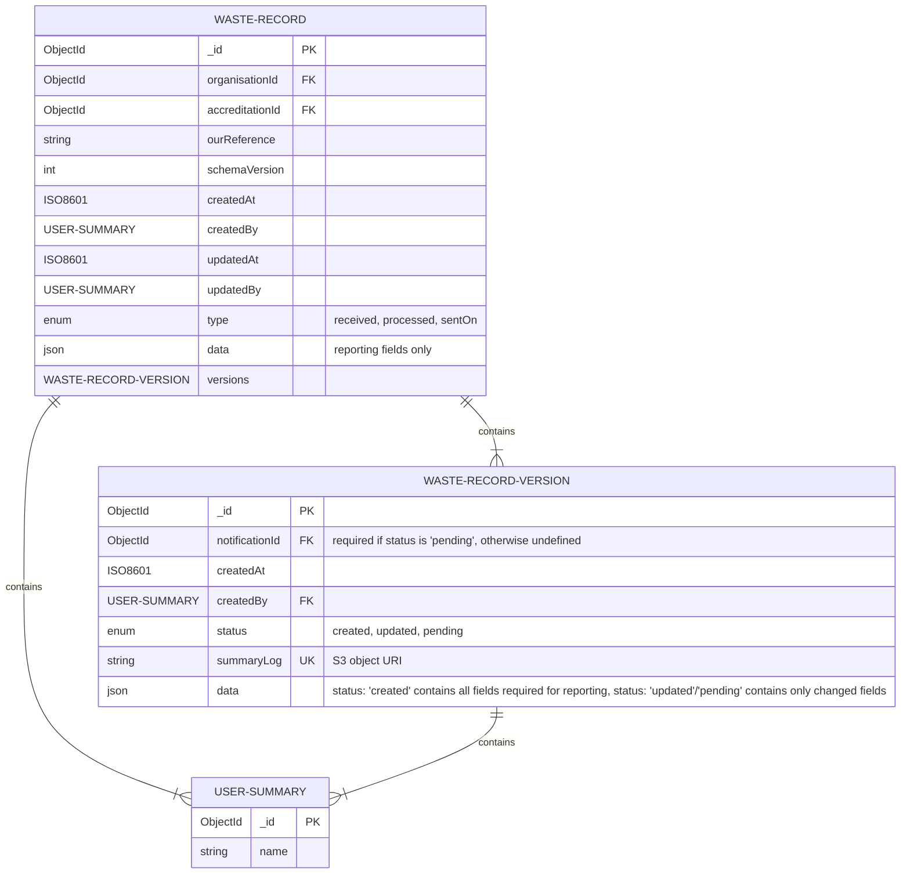

# pEPR: High Level Design

## Basic structure

This structure contains entities that cover the majority of use cases for 2026 deadlines.


```mermaid
erDiagram

%% Entities
USER["👤 Operator: User"]
PRN-SIGNATORY["👤 Operator: PRN Signatory"]
approver["👤 Operator: Approved Person"]
regulator["👤 Regulator"]
producer["👤 Producer"]
organisation["Organisation"]
accreditation["Accreditation"]
notification["Notification"]
summaryLog["📁 Summary Log"]
summaryLogArchive["Summary Log Archive"]
WASTE-RECORD["Waste Record"]
WASTE-BALANCE["Waste Balance"]
PRN
REPORT["Report"]

%% Structure
notification }|--|{ USER : "sent to"
notification }|--|{ approver : "sent to"
notification }|--|{ PRN-SIGNATORY : "sent to"
notification }|--|{ regulator : "sent to"
accreditation }|--|| organisation : "child of"
WASTE-RECORD }|--|| accreditation : "linked to"
WASTE-BALANCE ||--|| accreditation : "child of"
WASTE-RECORD }|--|| REPORT : "linked to"
PRN }|--|{ REPORT : "linked to"
WASTE-BALANCE ||--|| WASTE-RECORD : "linked to"
WASTE-RECORD ||--|| summaryLogArchive : "linked to"

%% Actions
producer }|--o{ PRN : accepts
producer }|--o{ PRN : rejects
USER }|--|{ summaryLog : uploads
USER }|--o{ PRN : issues
USER }|--o{ PRN : cancels
USER }|--o{ PRN : downloads
PRN-SIGNATORY }|--|{ PRN : authorises
approver }|--|{ WASTE-RECORD : approves
regulator }|--|{ REPORT : receives
regulator }|--|{ PRN : cancels
USER }|--|{ REPORT : creates
approver }|--|{ REPORT : submits

%% Effects
summaryLog ||--|| WASTE-RECORD : creates
summaryLog ||--o| WASTE-RECORD : adjusts
WASTE-RECORD }|--|| WASTE-BALANCE : updates
PRN }|--|| WASTE-BALANCE : updates
```

## API Endpoints

The endpoints below are grouped by the entity they are associated with, the idea here being by providing
self-explanatory endpoints that can be used to retrieve entities as resources.

Consumers can use the data in a way that is most appropriate to their use case and without requesting further endpoints
to service their needs if the project scope changes over time.

This should save time and effort in the backend but does come at the cost of slightly more complex Front End development.

> [!TIP]
> Given the number of endpoints, it may be useful to consider using [HATEOAS](https://en.wikipedia.org/wiki/HATEOAS) to provide a more intuitive API.

### Organisations

#### `GET /v1/organisations`

Used to retrieve a list of organisation summary data for Regulators or Consultants to select from.

> N.B. For the sake of brevity: Regulators and Consultants will not be referred to in the following sections, but they will have the same read access.
>
> See the [Role-Based Access Control](#role-based-access-control) section for more details.

#### `GET /v1/organisations/{id}`

Used to retrieve an organisation by ID for Operators to view the sites, materials & accreditations associated with the organisation.

Registrations can be cancelled, Accreditations can be cancelled/suspended.

Cancelled registrations will result in changed permissions for PRNs and no reporting requirements
Cancelled/Suspended accreditations will result in changed permissions for PRNs and different reporting requirements.

### Summary Logs

#### `POST /v1/organisations/{id}/materials/{id}/summary-log/validate`

Used to upload a summary log for validation.

#### `POST /v1/organisations/{id}/materials/{id}/summary-logs`

Used to upload a summary log to a material.

### Waste Records

#### `GET /v1/organisations/{id}/materials/{id}/waste-records`

Used to retrieve a list of waste records for Operators to select from.

#### `GET /v1/organisations/{id}/materials/{id}/waste-records/{id}`

Used to retrieve a waste record by ID for Operators to view the events associated with the waste record.

#### `PUT /v1/organisations/{id}/materials/{id}/waste-records/{id}/status`

Used to update a waste record's status

> [!INFO]
> This could alternatively be provided by a `PATCH` verb on the Waste Record resource, limited to the status field

> [!WARNING]
> N.B. This will need to be protected with role/permission authorisation

### PRNs

#### `POST /v1/organisations/{id}/materials/{id}/packaging-recycling-notes`

Used to create packaging recycling notes for a material.

#### `PUT /v1/organisations/{id}/materials/{id}/packaging-recycling-notes/{id}`

Used to update packaging recycling notes for a material.

#### `PUT /v1/organisations/{id}/materials/{id}/packaging-recycling-notes/{id}/status`

Used to update a packaging recycling note's status.

> [!INFO]
> This could alternatively be provided by a `PATCH` verb on the PRN resource, limited to the status field

> [!WARNING]
> N.B. This will need to be protected with role/permission authorisation

#### `GET /v1/organisations/{id}/materials/{id}/packaging-recycling-notes`

Used to retrieve a list of packaging recycling notes for a material.

#### `GET /v1/organisations/{id}/materials/{id}/packaging-recycling-notes/{id}`

Used to retrieve a packaging recycling note by ID for Operators to view the details of the note.

#### RPD Integration

We will likely need some endpoints for integration purposes with RPD, this is an unknown at this stage.

### Reports

#### `POST /v1/organisations/{id}/materials/{id}/reports`

Used to create a report for a material.

#### `PUT /v1/organisations/{id}/materials/{id}/reports/{id}`

Used to update a report for a material. e.g. add "user entered" fields such as "weight of waste recycled", "weight of waste not recycled", "PRNs revenue"

> [!INFO]
> This could alternatively be provided by a `PATCH` verb on the Report resource, limited to the fields listed above

#### `PUT /v1/organisations/{id}/materials/{id}/reports/{id}/approve`

Used to approve/submit a report.

> [!WARNING]
> N.B. This will need to be protected with role/permission authorisation

#### `GET /v1/organisations/{id}/reports`

Used to retrieve a list of reports for all materials.

#### `GET /v1/organisations/{id}/materials/{id}/reports`

Used to retrieve a list of reports for a material.

#### `GET /v1/organisations/{id}/materials/{id}/reports/{id}`

Used to retrieve a report by ID for Operators to view the details of the report.

## Specific structures & use cases

### Exporters

TBD

### Consultants

TBD

## Ingestion of Registrations & Accreditations data from Regulators

There are two ways to ingest data from Regulators:

1. Through a data processing pipeline, where a feed of data is provided via a file store, e.g. SFTP uploads, processed on a schedule and then imported into the system
2. Directly via an Admin UI: Regulators log in, locate entities and edit them directly

Benefits of Admin UI over a data processing pipeline:

1. Monitoring capability of the running System from day one
2. Provides Regulators access to the system
3. Management of Regulator access
4. Provides a System Log of actions completed by colleagues, regulators & users

### Services overview


```mermaid
flowchart TD;
    USER((User))
    SUPER-USER((Super User))
    REGULATOR((Regulator))

  classDef invisible opacity:0

  subgraph protected zone
    subgraph PROTECTED-ZONE-NESTED
      EPR-ADMIN-UI([EPR Admin UI])
      EPR-ADMIN-BFF(EPR Admin Backend For Frontend)
      EPR-BACKEND{{EPR Backend}}
    end
  end

  subgraph public zone
    subgraph PUBLIC-ZONE-NESTED
      EPR-FRONTEND([EPR Frontend])
      EPR-BFF(EPR Backend For Frontend)
    end
  end

  PROTECTED-ZONE-NESTED:::invisible
  PUBLIC-ZONE-NESTED:::invisible

  USER-. public access: Defra ID .->EPR-FRONTEND;
  REGULATOR-. restricted access: AAD SSO .->EPR-ADMIN-UI;
  SUPER-USER-. restricted access: AAD SSO .->EPR-ADMIN-UI;

  EPR-FRONTEND-->EPR-BFF;
  EPR-ADMIN-UI-->EPR-ADMIN-BFF;

  EPR-BFF--access authenticated endpoints -->EPR-BACKEND;
  EPR-ADMIN-BFF--access AAD SSO protected endpoints -->EPR-BACKEND;
```

### CRUD by Entity Type

| Entity Type   | Admin: SuperUser | Admin: Regulator | Public: User | Notes                                                                                             |
| ------------- | ---------------- | ---------------- | ------------ | ------------------------------------------------------------------------------------------------- |
| User          | CRUD             | CRUD             | -R--         | Only draft users of limited roles are eligible for deletion                                       |
| User-Role     | ----             | ----             | ----         | User and Regulator roles                                                                          |
| Organisation  | -RU-             | -RU-             | -R--         | Created on application                                                                            |
| Material      | -RU-             | -RU-             | -R--         | Created on application, unique to Activity & Site, contains Accreditation                         |
| Accreditation | -RU-             | -RU-             | -R--         | Created on application, nested under Material                                                     |
| Summary-Log   | -R--             | -R--             | CR--         | Summary Logs are immutable and stored in S3 for history purposes                                  |
| Waste-Record  | -R--             | -R--             | -RU-         | Update is result of Summary-Log create                                                            |
| Waste-Balance | -R--             | -R--             | -RU-         | Update is result of Summary-Log create or PRN create/update                                       |
| PRN           | -RU-             | -RU-             | CRU-         |                                                                                                   |
| Report        | -R--             | -R--             | CRU-         |                                                                                                   |
| Notification  | -RU-             | -RU-             | -RU-         | All Notifications are system generated, updates take place via status changes on related entities |
| System-Log    | -R--             | ----             | ----         | For monitoring purposes, not to be confused with SOC auditing                                     |

### Role-Based Access Control

| Permission                | Super User | Regulator | Approved Person | PRN Signatory | User |
| ------------------------- | ---------- | --------- | --------------- | ------------- | ---- |
| **User:view**             | ✔         | ✔        | ✔              | ✔            | ✔   |
| **User:add**              | ✔         | ✔        |                 |               |      |
| **User:edit**             | ✔         | ✔        |                 |               |      |
| **User:remove**           | ✔         | ✔        |                 |               |      |
| =====================     | ========== | ========= | =============== | ============= | ==== |
| **Organisation:view**     | ✔         | ✔        | ✔              | ✔            | ✔   |
| **Organisation:edit**     | ✔         | ✔        |                 |               |      |
| **Organisation:approve**  | ✔         | ✔        |                 |               |      |
| **Organisation:reject**   | ✔         | ✔        |                 |               |      |
| =====================     | ========== | ========= | =============== | ============= | ==== |
| **Material:view**         | ✔         | ✔        | ✔              | ✔            | ✔   |
| **Material:edit**         | ✔         | ✔        |                 |               |      |
| **Material:approve**      | ✔         | ✔        |                 |               |      |
| **Material:reject**       | ✔         | ✔        |                 |               |      |
| =====================     | ========== | ========= | =============== | ============= | ==== |
| **Accreditation:view**    | ✔         | ✔        | ✔              | ✔            | ✔   |
| **Accreditation:edit**    | ✔         | ✔        |                 |               |      |
| **Accreditation:approve** | ✔         | ✔        |                 |               |      |
| **Accreditation:reject**  | ✔         | ✔        |                 |               |      |
| =====================     | ========== | ========= | =============== | ============= | ==== |
| **Summary-Log:view**      | ✔         | ✔        | ✔              | ✔            | ✔   |
| **Summary-Log:validate**  |            |           | ✔              | ✔            | ✔   |
| **Summary-Log:submit**    |            |           | ✔              | ✔            | ✔   |
| =====================     | ========== | ========= | =============== | ============= | ==== |
| **Waste-Record:view**     | ✔         | ✔        | ✔              | ✔            | ✔   |
| =====================     | ========== | ========= | =============== | ============= | ==== |
| **Waste-Balance:view**    | ✔         | ✔        | ✔              | ✔            | ✔   |
| =====================     | ========== | ========= | =============== | ============= | ==== |
| **PRN:view**              | ✔         | ✔        | ✔              | ✔            | ✔   |
| **PRN:add**               |            |           | ✔              | ✔            | ✔   |
| **PRN:edit**              |            |           | ✔              | ✔            | ✔   |
| **PRN:approve**           |            |           |                 | ✔            |      |
| **PRN:reject**            |            |           |                 | ✔            |      |
| =====================     | ========== | ========= | =============== | ============= | ==== |
| **Report:view**           | ✔         | ✔        | ✔              | ✔            | ✔   |
| **Report:add**            |            |           | ✔              | ✔            | ✔   |
| **Report:edit**           |            |           | ✔              | ✔            | ✔   |
| **Report:approve**        |            |           | ✔              |               |      |
| **Report:reject**         |            |           | ✔              |               |      |
| =====================     | ========== | ========= | =============== | ============= | ==== |
| **Notification:view**     | ✔         | ✔        | ✔              | ✔            | ✔   |
| =====================     | ========== | ========= | =============== | ============= | ==== |
| **System-Log:view**       | ✔         |           |                 |               |      |

### Waste Record

The Waste Record is the entity used to track key reporting data uploaded by Summary Logs.


```mermaid
erDiagram
  WASTE-RECORD {
    ObjectId _id PK
    ObjectId organisationId FK
    ObjectId accreditationId FK
    string ourReference
    int schemaVersion
    ISO8601 createdAt
    USER-SUMMARY createdBy
    ISO8601 updatedAt
    USER-SUMMARY updatedBy
    enum type "received, processed, sentOn"
    json data "reporting fields only"
    WASTE-RECORD-VERSION versions
  }

  WASTE-RECORD-VERSION {
    ObjectId _id PK
    ObjectId notificationId FK "required if status is 'pending', otherwise undefined"
    ISO8601 createdAt
    USER-SUMMARY createdBy FK
    enum status "created, updated, pending"
    string summaryLog UK "S3 object URI"
    json data "status: 'created' contains all fields required for reporting, status: 'updated'/'pending' contains only changed fields"
  }

  USER-SUMMARY {
    ObjectId _id PK
    string name
  }

  WASTE-RECORD ||--|{ WASTE-RECORD-VERSION : contains
  WASTE-RECORD ||--|{ USER-SUMMARY : contains
  WASTE-RECORD-VERSION ||--|{ USER-SUMMARY : contains
```

#### Type: Received

In this example:

1. Alice has created a `received` waste record
2. Bob has updated the waste record, but introduced a mistake
3. Alice has corrected the mistake, but the reporting period is closed and the record is now pending

```json5
{
  _id: 'a1234567890a12345a01',
  accreditationId: 'b1234567890a12345a01',
  organisationId: 'e1234567890a12345a01',
  ourReference: '12345678910',
  type: 'received',
  createdAt: '2026-01-08T12:00:00.000Z',
  createdBy: {
    _id: 'c1234567890a12345a01',
    name: 'Alice'
  },
  updatedAt: '2026-01-09T12:00:00.000Z',
  updatedBy: {
    _id: 'c1234567890a12345a02',
    name: 'Bob'
  },
  data: {
    dateReceived: '2026-01-01',
    grossWeight: 10.0,
    tonnageForPrn: 0.5
    // ...
  },
  versions: [
    {
      id: 'd1234567890a12345a01',
      status: 'created',
      createdAt: '2026-01-08T12:00:00.000Z',
      createdBy: {
        _id: 'c1234567890a12345a01',
        name: 'Alice'
      },
      summaryLog: 's3://path/to/summary/log/upload/1',
      data: {
        dateReceived: '2026-01-01',
        grossWeight: 1.0,
        tonnageForPrn: 0.5
        // ...
      }
    },
    {
      id: 'd1234567890a12345a02',
      status: 'updated',
      createdAt: '2026-01-09T12:00:00.000Z',
      createdBy: {
        _id: 'c1234567890a12345a02',
        name: 'Bob'
      },
      summaryLog: 's3://path/to/summary/log/upload/2',
      data: {
        grossWeight: 10.0
      }
    },
    {
      id: 'd1234567890a12345a03',
      notificationId: 'e1234567890a12345a01',
      status: 'pending',
      createdAt: '2026-01-09T12:00:00.000Z',
      createdBy: {
        _id: 'c1234567890a12345a01',
        name: 'Alice'
      },
      summaryLog: 's3://path/to/summary/log/upload/3',
      data: {
        grossWeight: 1.0
      }
    }
  ]
}
```

#### Type: processed

In this example Alice has created a `processed` waste record

```json5
{
  _id: 'a1234567890a12345a02',
  accreditationId: 'b1234567890a12345a01',
  organisationId: 'e1234567890a12345a01',
  ourReference: '12345678911',
  type: 'processed',
  createdAt: '2026-01-08T12:00:00.000Z',
  createdBy: {
    _id: 'c1234567890a12345a01',
    name: 'Alice'
  },
  updatedAt: null,
  updatedBy: null,
  data: {
    dateLoadLeftSite: '2026-01-01',
    sentTo: 'name',
    weight: 1.0
    // ...
  },
  versions: [
    {
      id: 'd1234567890a12345a01',
      status: 'created',
      createdAt: '2026-01-08T12:00:00.000Z',
      createdBy: {
        _id: 'c1234567890a12345a01',
        name: 'Alice'
      },
      summaryLog: 's3://path/to/summary/log/upload/1',
      data: {
        dateLoadLeftSite: '2026-01-01',
        sentTo: 'name',
        weight: 1.0
        // ...
      }
    }
  ]
}
```

#### Type: sentOn

In this example Alice has created a `sentOn` waste record

```json5
{
  _id: 'a1234567890a12345a03',
  accreditationId: 'b1234567890a12345a01',
  organisationId: 'e1234567890a12345a01',
  ourReference: '12345678912',
  type: 'sentOn',
  createdAt: '2026-01-08T12:00:00.000Z',
  createdBy: {
    _id: 'c1234567890a12345a01',
    name: 'Alice'
  },
  updatedAt: null,
  updatedBy: null,
  data: {
    dateLoadLeftSite: '2026-01-01',
    sentTo: 'name',
    weight: 1.0
    // ...
  },
  versions: [
    {
      id: 'd1234567890a12345a01',
      status: 'created',
      createdAt: '2026-01-08T12:00:00.000Z',
      createdBy: {
        _id: 'c1234567890a12345a01',
        name: 'Alice'
      },
      summaryLog: 's3://path/to/summary/log/upload/1',
      data: {
        dateLoadLeftSite: '2026-01-01',
        sentTo: 'name',
        weight: 1.0
        // ...
      }
    }
  ]
}
```

### Questions

_Q: What is `ourReference`? Is it unique per row? How is combinging two incoming batches of waste into one outgoing unit modeled?_

Jacky said outgoing references are not related to the incomming ones

"not trying to align whats in tab 1 with whats in tab 2 or tab 3"

Vast majority of records based on data in tab 1

_Q: Should we assume `ourReference` numbers are going to be repeated across operators (and years)? What about across tabs on the same summary log?_

`ourReference` should be unqiue across a spreadhsheet _somehow_

Note there is also a _theirReference_ (optional) in the spreadsheet

_Q: Is the inclusion of a waste record in a given reporting based on "date received", or "date submitted into service" or something else?_

_Q: tonnage in report. There is not a similar row-by-row page in reporting for recycled. Why?_

Don't need tonnage by supplier in the report

TODO: Discuss how to handle Waste Records that are pending approval from regulator or a material suspension being lifted
