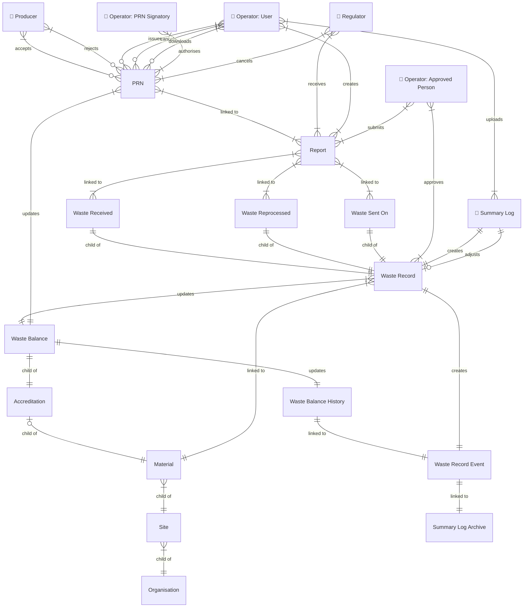
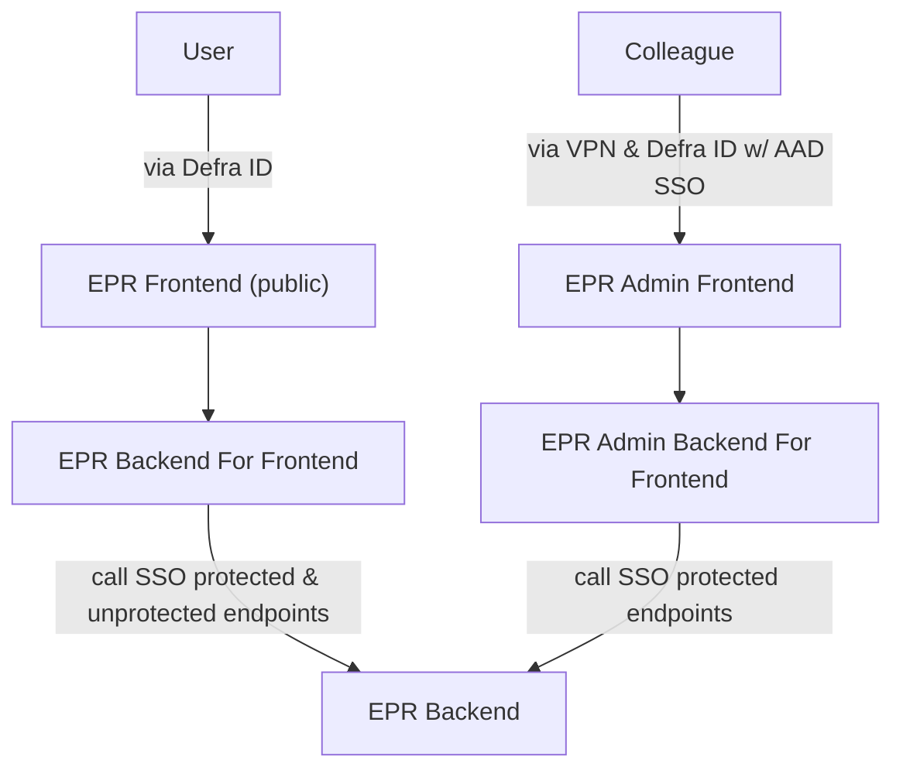

# pEPR: High Level Design

## Basic structure

This structure contains entities that cover the majority of use cases for 2026 deadlines.

```mermaid
erDiagram

%% Entities
organisation["Organisation"]
user["👤 Operator: User"]
signatory["👤 Operator: PRN Signatory"]
approver["👤 Operator: Approved Person"]
regulator["👤 Regulator"]
producer["👤 Producer"]
site["Site"]
accreditation["Accreditation"]
material["Material"]
summaryLog["📁 Summary Log"]
summaryLogArchive["Summary Log Archive"]
wasteRecord["Waste Record"]
wasteRecordEvent["Waste Record Event"]
wasteBalance["Waste Balance"]
wasteBalanceHistory["Waste Balance History"]
prn["PRN"]
report["Report"]
wasteReceived["Waste Received"]
wasteReprocessed["Waste Reprocessed"]
wasteSentOn["Waste Sent On"]

%% Structure
accreditation |o--|| material : "child of"
wasteRecord }|--|| material : "linked to"
material }|--|| site : "child of"
site }|--|| organisation : "child of"
wasteBalance ||--|| accreditation : "child of"
wasteReceived ||--|| wasteRecord : "child of"
wasteReprocessed ||--|| wasteRecord : "child of"
wasteSentOn ||--|| wasteRecord : "child of"
report }|--|{ wasteReceived : "linked to"
report }|--|{ wasteReprocessed : "linked to"
report }|--|{ wasteSentOn : "linked to"
prn }|--|{ report : "linked to"
wasteBalanceHistory ||--|| wasteRecordEvent : "linked to"
wasteRecordEvent ||--|| summaryLogArchive : "linked to"

%% Actions
producer }|--o{ prn : accepts
producer }|--o{ prn : rejects
user }|--|{ summaryLog : uploads
user }|--o{ prn : issues
user }|--o{ prn : cancels
user }|--o{ prn : downloads
signatory }|--|{ prn : authorises
approver }|--|{ wasteRecord : approves
regulator }|--|{ report : receives
regulator }|--|{ prn : cancels
user }|--|{ report : creates
approver }|--|{ report : submits

%% Effects
wasteRecord ||--|| wasteRecordEvent : creates
wasteBalance ||--|| wasteBalanceHistory : updates
summaryLog ||--|| wasteRecord : creates
summaryLog ||--o| wasteRecord : adjusts
wasteRecord }|--|| wasteBalance : updates
prn }|--|| wasteBalance : updates
```

## API Endpoints

The endpoints below are grouped by the entity they are associated with, the idea here being by providing
self-explanatory endpoints that can be used to retrieve entities as resources.

Consumers can use the data in a way that is most appropriate to their use case and without requesting further endpoints
to service their needs if the project scope changes over time.

This should save time and effort in the backend but does come at the cost of slightly more complex Front End development.

> [!TIP]
> Given the number of endpoints, it may be useful to consider using [HATEOAS](https://en.wikipedia.org/wiki/HATEOAS) to provide a more intuitive API.

### Organisations

#### `GET /v1/organisations`

Used to retrieve a list of organisation summary data for Consultants to select from.

> N.B. For the sake of brevity, Consultants will be referred to as Operators in the following sections.

#### `GET /v1/organisations/{id}`

Used to retrieve an organisation by ID for Operators to view the sites, materials & accreditations associated with the organisation.

### Summary Logs

#### `POST /v1/organisations/{id}/sites/{id}/materials/{id}/accreditations/{id}/summary-log/validate`

Used to upload a summary log for validation.

#### `POST /v1/organisations/{id}/sites/{id}/materials/{id}/accreditations/{id}/summary-logs`

Used to upload a summary log to an accreditation.

### Waste Records

#### `GET /v1/organisations/{id}/sites/{id}/materials/{id}/accreditations/{id}/waste-records`

Used to retrieve a list of waste records for Operators to select from.

#### `GET /v1/organisations/{id}/sites/{id}/materials/{id}/accreditations/{id}/waste-records/{id}`

Used to retrieve a waste record by ID for Operators to view the events associated with the waste record.

#### `PUT /v1/organisations/{id}/sites/{id}/materials/{id}/accreditations/{id}/waste-records/{id}/status`

Used to update a waste record's status

> [!INFO]
> This could alternatively be provided by a `PATCH` verb on the Waste Record resource, limited to the status field

> [!WARNING]
> N.B. This will need to be protected with role/permission authorisation

#### `GET /v1/organisations/{id}/sites/{id}/materials/{id}/accreditations/{id}/waste-records/{id}/events`

Used to retrieve a list of events for a waste record.

> N.B. This may not be necessary initially if we can find a way to meet the requirements by storing and exposing a history of the original summary log files.

#### `GET /v1/organisations/{id}/sites/{id}/materials/{id}/accreditations/{id}/waste-records/{id}/events/{id}`

Used to retrieve an event by ID for Operators to view the details of the event.

> N.B. This may not be necessary initially if we can find a way to meet the requirements by storing and exposing a history of the original summary log files.

### PRNs

#### `POST /v1/organisations/{id}/sites/{id}/materials/{id}/accreditations/{id}/packaging-recycling-notes`

Used to create packaging recycling notes for an accreditation.

#### `PUT /v1/organisations/{id}/sites/{id}/materials/{id}/accreditations/{id}/packaging-recycling-notes/{id}`

Used to update packaging recycling notes for an accreditation.

#### `PUT /v1/organisations/{id}/sites/{id}/materials/{id}/accreditations/{id}/packaging-recycling-notes/{id}/status`

Used to update a packaging recycling note's status.

> [!INFO]
> This could alternatively be provided by a `PATCH` verb on the PRN resource, limited to the status field

> [!WARNING]
> N.B. This will need to be protected with role/permission authorisation

#### `GET /v1/organisations/{id}/sites/{id}/materials/{id}/accreditations/{id}/packaging-recycling-notes`

Used to retrieve a list of packaging recycling notes for an accreditation.

#### `GET /v1/organisations/{id}/sites/{id}/materials/{id}/accreditations/{id}/packaging-recycling-notes/{id}`

Used to retrieve a packaging recycling note by ID for Operators to view the details of the note.

#### RPD Integration

We will likely need some endpoints for integration purposes with RPD, this is an unknown at this stage.

### Reports

#### `POST /v1/organisations/{id}/sites/{id}/materials/{id}/accreditations/{id}/reports`

Used to create a report for an accreditation.

#### `PUT /v1/organisations/{id}/sites/{id}/materials/{id}/accreditations/{id}/reports/{id}`

Used to update a report for an accreditation. e.g. add "user entered" fields such as "weight of waste recycled", "weight of waste not recycled", "PRNs revenue"

> [!INFO]
> This could alternatively be provided by a `PATCH` verb on the Report resource, limited to the fields listed above

#### `PUT /v1/organisations/{id}/sites/{id}/materials/{id}/accreditations/{id}/reports/{id}/approve`

Used to approve/submit a report.

> [!WARNING]
> N.B. This will need to be protected with role/permission authorisation

#### `GET /v1/organisations/{id}/reports`

Used to retrieve a list of reports for all accreditations.

#### `GET /v1/organisations/{id}/sites/{id}/materials/{id}/accreditations/{id}/reports`

Used to retrieve a list of reports for an accreditation.

#### `GET /v1/organisations/{id}/sites/{id}/materials/{id}/accreditations/{id}/reports/{id}`

Used to retrieve a report by ID for Operators to view the details of the report.

## Specific structures & use cases

### Exporters

TBD

### Consultants

TBD

## Ingestion of Registrations & Accreditations data from Regulators

TBD

## Potential approach to de-risking project

### Spike tickets:

1. Investigate how other teams are using Admin Frontends
2. Investigate Defra ID, including AAD SSO
3. PoC Admin Frontend, locked down by IP address (VPN only)
4. PAE-203: with SSO protection
5. API integration using SSO
6. Using Prototype Kit for Frontend

> Of these, items that also de-risks the EPR frontend are: 2, 3 (limited), 4, 5 & 6.

Benefits of Admin Frontend:

1. Starts the de-risking of the frontend early in the project
2. System observability
3. Access to a paper-trail/auditing of actions completed by users
4. Formations of a system that provides Regulatory access to the system

Other spikes, that could be started soon:

1. CDP Uploader
2. S3 storage, e.g. Summary Logs
3. Data merging/migration
4. Investigate trade-offs between storing Summary Log files vs Waste Record History in database

### Basic solution overview that incorporates front-end & admin front-end

```mermaid
flowchart TD;
    USER[User]
    COLLEAGUE[Colleague]
    EPR_BACKEND[EPR Backend]
    EPR_FRONTEND["EPR Frontend (public)"]
    EPR_BFF[EPR Backend For Frontend]
    EPR_ADMIN_FRONTEND[EPR Admin Frontend]
    EPR_ADMIN_BFF[EPR Admin Backend For Frontend]

    USER-- via Defra ID -->EPR_FRONTEND;
    COLLEAGUE-- via VPN & Defra ID w/ AAD SSO -->EPR_ADMIN_FRONTEND;

    EPR_FRONTEND-->EPR_BFF;
    EPR_ADMIN_FRONTEND-->EPR_ADMIN_BFF;

    EPR_BFF--call SSO protected & unprotected endpoints -->EPR_BACKEND;
    EPR_ADMIN_BFF--call SSO protected endpoints -->EPR_BACKEND;
```
