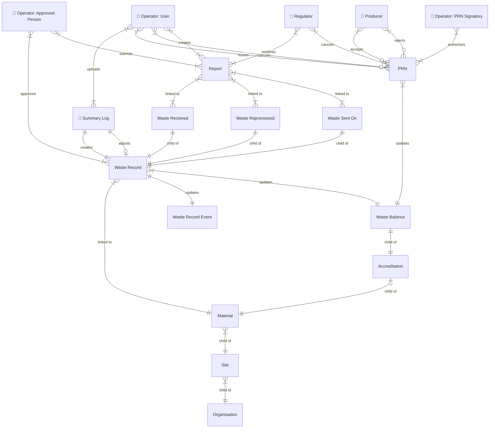

# pEPR: High Level Design

## Basic structure

This structure contains entities that cover the majority of use cases for 2026 deadlines.

```mermaid
erDiagram

%% Entities
organisation["Organisation"]
user["👤 Operator: User"]
signatory["👤 Operator: PRN Signatory"]
approver["👤 Operator: Approved Person"]
regulator["👤 Regulator"]
producer["👤 Producer"]
site["Site"]
accreditation["Accreditation"]
material["Material"]
summaryLog["📁 Summary Log"]
wasteRecord["Waste Record"]
wasteRecordEvent["Waste Record Event"]
wasteBalance["Waste Balance"]
prn["PRN"]
report["Report"]
wasteReceived["Waste Received"]
wasteReprocessed["Waste Reprocessed"]
wasteSentOn["Waste Sent On"]

%% Structure
accreditation |o--|| material : "child of"
wasteRecord }|--|| material : "linked to"
material }|--|| site : "child of"
site }|--|| organisation : "child of"
wasteBalance ||--|| accreditation : "child of"
wasteReceived ||--|| wasteRecord : "child of"
wasteReprocessed ||--|| wasteRecord : "child of"
wasteSentOn ||--|| wasteRecord : "child of"
report }|--|{ wasteReceived : "linked to"
report }|--|{ wasteReprocessed : "linked to"
report }|--|{ wasteSentOn : "linked to"

%% Actions
producer }|--o{ prn : accepts
producer }|--o{ prn : rejects
user }|--|{ summaryLog : uploads
user }|--o{ prn : issues
user }|--o{ prn : cancels
signatory }|--|{ prn : authorises
approver }|--|{ wasteRecord : approves
regulator }|--|{ report : receives
regulator }|--|{ prn : cancels
user }|--|{ report : creates
approver }|--|{ report : submits

%% Effects
wasteRecord ||--|| wasteRecordEvent : updates
summaryLog ||--|| wasteRecord : creates
summaryLog ||--o| wasteRecord : adjusts
wasteRecord }|--|| wasteBalance : updates
prn }|--|| wasteBalance : updates
```

## API Endpoints

### Organisations

`GET /v1/organisations`

`GET /v1/organisations/{id}`

### Sites

`GET /v1/sites`

`GET /v1/sites/{id}`

### Materials

`GET /v1/materials`

`GET /v1/materials/{id}`

### Accreditations

`GET /v1/accreditations`

`GET /v1/accreditations/{id}`

`GET /v1/accreditations/{id}/waste-balance`

### Summary Logs

`POST /v1/summary-logs`

### Waste Records

`GET /v1/waste-records`

`GET /v1/waste-records/{id}`

`GET /v1/waste-records/{id}/events`

`GET /v1/waste-records/{id}/events/{id}`

### PRNs

`POST /v1/packaging-recycling-notes`

`PUT /v1/packaging-recycling-notes/{id}`

`GET /v1/packaging-recycling-notes`

`GET /v1/packaging-recycling-notes/{id}`

### Reports

`POST /v1/reports`

`PUT /v1/reports/{id}`

`GET /v1/reports`

`GET /v1/reports/{id}`

## Specific structures & use cases

### Exporters

TBD

### Consultants

TBD

## Ingestion of Registrations & Accreditations data from Regulators

TBD
