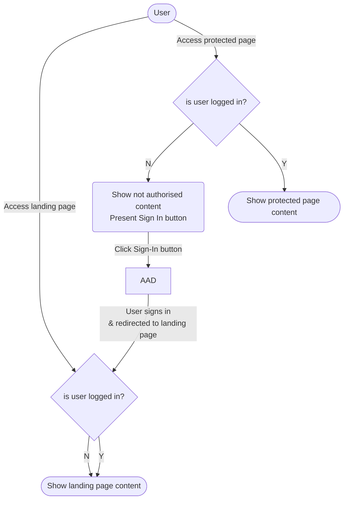
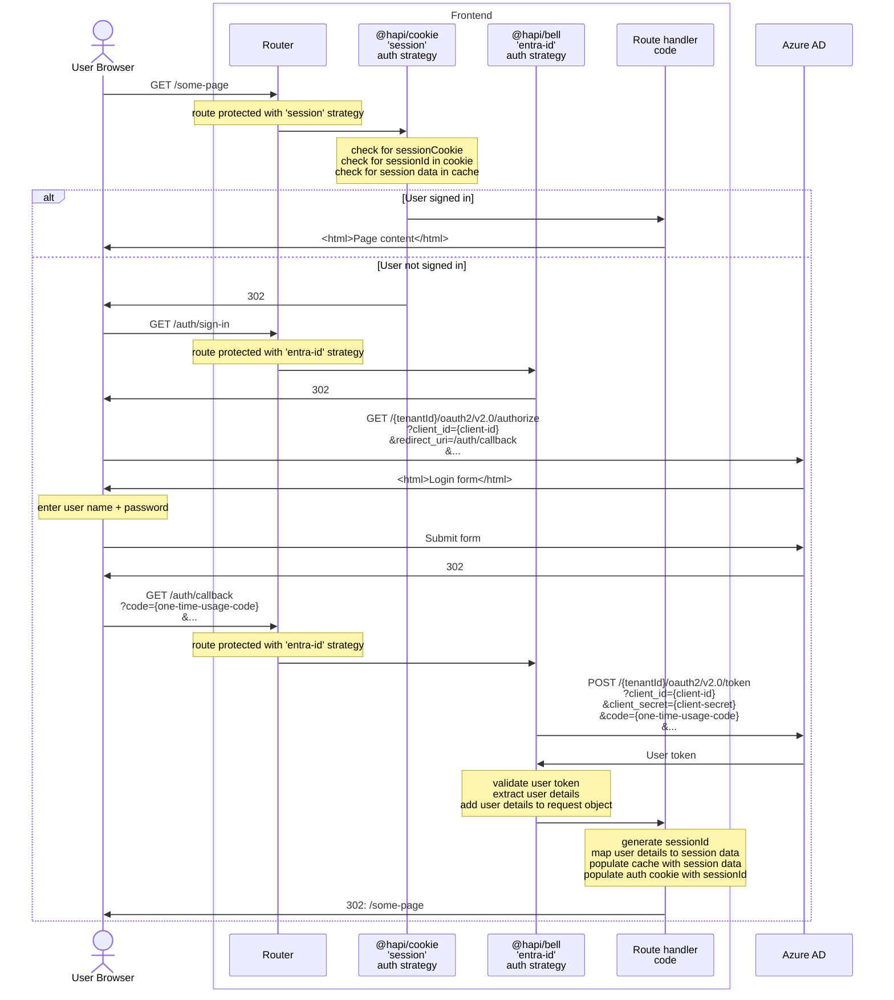

# pEPR: Low level design - Admin UI Authentication & Authorisation

> [!WARNING]
> This document is a work in progress and is subject to change.

<!-- prettier-ignore-start -->

- [Overview](#overview)
- [User groups](#user-groups)
- [AAD interaction](#aad-interaction)
  - [User sign in journey](#user-sign-in-journey)
  - [AAD flow](#aad-flow)
  <!-- prettier-ignore-end -->

## Overview

The Admin UI service is only accessible to users on the Defra internal network - a landing page is accessible without requiring the user to be signed in.

Access to the functional parts of the service are protected as follows

- **Authentication** is via Microsoft Azure Active Directory (AAD)
  - Users sign in to the service via Single-Sign-On to Defra's AAD tenant
- **Authorisation** is managed within the service
  - A signed-in user is identified from their AAD details
  - The service internally maps the user to one or more _user groups_
- **Role based access control (RBAC)** permits access to a specific user groups on a per page basis

## User groups

The user groups are

1. `service maintainers`
1. `regulators`

See [HLD](./pepr-hld.md#who-is-using-this-service) for a description of the roles/responsibilities of these user groups

## AAD interaction

To sign in to the service the user is re-directed to AAD to perform single sign on, where

- the user signs in to AAD with their AAD username + password
- upon sign-in they are re-directed back to the service
- the service exchanges tokens with AAD (allowing it to identify the user)

The AAD sign-in URL is

`https://login.microsoftonline.com/{tenantId}/oauth2/v2.0/authorize?client_id={clientId}`

- `tenantId` = a "tenant" set up within Entra ID
  - Use "DefraDev" tenant to sign in to our app in `local|dev|test` environments
  - Use "Defra" tenant to sign in to our app in `prod` environment
- `clientId` = an identifier for "our app" - this is known to AAD, ie has been created in Entra ID within the specific tenant
  - A shared value is used across the `local`, `dev` and `test` environments (as configured in the "DefraDev" tenant)
  - Another value is used in the `prod` environment (as configured in the "Defra" tenant)

### User sign in journey

> [!INFO]
> This represents the initial (simplest) journey being built - it is expecteded to change in future iterations to provide an improved user experience

### AAD flow

The interaction between the service and AAD is orchestrated using `@hapi/bell` and `@hapi/cookie` plugins

