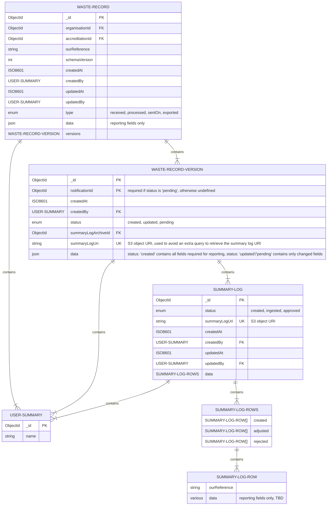
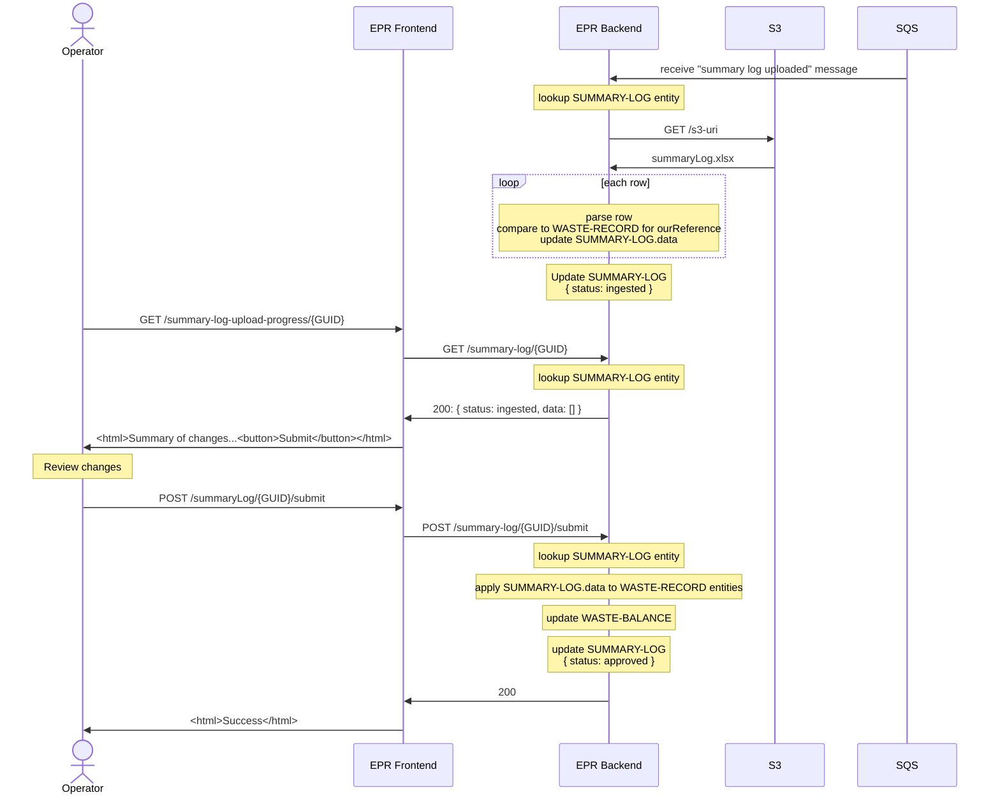

# pEPR Low level design

> [!WARNING]
> This document is a work in progress and is subject to change.

<!-- prettier-ignore-start -->
<!-- TOC -->
* [pEPR Low level design](#pepr-low-level-design)
  * [API Endpoints](#api-endpoints)
    * [Organisations](#organisations)
      * [`GET /v1/organisations`](#get-v1organisations)
      * [`GET /v1/organisations/{id}`](#get-v1organisationsid)
    * [Summary Logs](#summary-logs)
      * [`POST /v1/organisations/{id}/materials/{id}/summary-logs/validate`](#post-v1organisationsidmaterialsidsummary-logsvalidate)
      * [`POST /v1/organisations/{id}/materials/{id}/summary-logs/{id}/submit`](#post-v1organisationsidmaterialsidsummary-logsidsubmit)
    * [Waste Records](#waste-records)
      * [`GET /v1/organisations/{id}/materials/{id}/waste-records`](#get-v1organisationsidmaterialsidwaste-records)
      * [`GET /v1/organisations/{id}/materials/{id}/waste-records/{id}`](#get-v1organisationsidmaterialsidwaste-recordsid)
      * [`PUT /v1/organisations/{id}/materials/{id}/waste-records/{id}/status`](#put-v1organisationsidmaterialsidwaste-recordsidstatus)
    * [PRNs](#prns)
      * [`POST /v1/organisations/{id}/materials/{id}/packaging-recycling-notes`](#post-v1organisationsidmaterialsidpackaging-recycling-notes)
      * [`PUT /v1/organisations/{id}/materials/{id}/packaging-recycling-notes/{id}`](#put-v1organisationsidmaterialsidpackaging-recycling-notesid)
      * [`PUT /v1/organisations/{id}/materials/{id}/packaging-recycling-notes/{id}/status`](#put-v1organisationsidmaterialsidpackaging-recycling-notesidstatus)
      * [`GET /v1/organisations/{id}/materials/{id}/packaging-recycling-notes`](#get-v1organisationsidmaterialsidpackaging-recycling-notes)
      * [`GET /v1/organisations/{id}/materials/{id}/packaging-recycling-notes/{id}`](#get-v1organisationsidmaterialsidpackaging-recycling-notesid)
      * [RPD Integration](#rpd-integration)
    * [Reports](#reports)
      * [`POST /v1/organisations/{id}/materials/{id}/reports`](#post-v1organisationsidmaterialsidreports)
      * [`PUT /v1/organisations/{id}/materials/{id}/reports/{id}`](#put-v1organisationsidmaterialsidreportsid)
      * [`PUT /v1/organisations/{id}/materials/{id}/reports/{id}/approve`](#put-v1organisationsidmaterialsidreportsidapprove)
      * [`GET /v1/organisations/{id}/reports`](#get-v1organisationsidreports)
      * [`GET /v1/organisations/{id}/materials/{id}/reports`](#get-v1organisationsidmaterialsidreports)
      * [`GET /v1/organisations/{id}/materials/{id}/reports/{id}`](#get-v1organisationsidmaterialsidreportsid)
  * [CRUD by Entity Type](#crud-by-entity-type)
  * [Role-Based Access Control](#role-based-access-control)
  * [Entity Relationships](#entity-relationships)
    * [Users](#users)
    * [Waste Record](#waste-record)
      * [Type: Received](#type-received)
      * [Type: processed](#type-processed)
      * [Type: sentOn](#type-senton)
    * [Waste Balance](#waste-balance)
    * [PRN](#prn)
    * [Report](#report)
    * [Summary Log upload & ingest](#summary-log-upload--ingest)
      * [Phase 1 - upload, virus scan & creation of SUMMARY-LOG entity](#phase-1---upload-virus-scan--creation-of-summary-log-entity)
      * [Phase 2 - processing and submission of summary log](#phase-2---processing-and-submission-of-summary-log)
<!-- TOC -->

<!-- prettier-ignore-end -->

## API Endpoints

The endpoints below are grouped by the entity they are associated with, the idea here being by providing
self-explanatory endpoints that can be used to retrieve entities as resources.

Consumers can use the data in a way that is most appropriate to their use case and without requesting further endpoints
to service their needs if the project scope changes over time.

This should save time and effort in the backend but does come at the cost of slightly more complex Front End development.

> [!TIP]
> Given the number of endpoints, it may be useful to consider using [HATEOAS](https://en.wikipedia.org/wiki/HATEOAS) to provide a more intuitive API.

### Organisations

#### `GET /v1/organisations`

Used to retrieve a list of organisation summary data for Regulators or Consultants to select from.

> N.B. For the sake of brevity: Regulators and Consultants will not be referred to in the following sections, but they will have the same read access.
>
> See the [Role-Based Access Control](#role-based-access-control) section for more details.

#### `GET /v1/organisations/{id}`

Used to retrieve an organisation by ID for Operators to view the sites, materials & accreditations associated with the organisation.

Registrations can be cancelled, Accreditations can be cancelled/suspended.

Cancelled registrations will result in changed permissions for PRNs and no reporting requirements
Cancelled/Suspended accreditations will result in changed permissions for PRNs and different reporting requirements.

### Summary Logs

#### `POST /v1/organisations/{id}/materials/{id}/summary-logs/validate`

Returns a SUMMARY-LOG id, which can be used to retrieve data for creation of the waste record

Used to upload a summary log for validation.

#### `POST /v1/organisations/{id}/materials/{id}/summary-logs/{id}/submit`

Used to upload a summary log to a material.

### Waste Records

#### `GET /v1/organisations/{id}/materials/{id}/waste-records`

Used to retrieve a list of waste records for Operators to select from.

#### `GET /v1/organisations/{id}/materials/{id}/waste-records/{id}`

Used to retrieve a waste record by ID for Operators to view the events associated with the waste record.

#### `PUT /v1/organisations/{id}/materials/{id}/waste-records/{id}/status`

Used to update a waste record's status

> [!INFO]
> This could alternatively be provided by a `PATCH` verb on the Waste Record resource, limited to the status field

> [!WARNING]
> N.B. This will need to be protected with role/permission authorisation

### PRNs

#### `POST /v1/organisations/{id}/materials/{id}/packaging-recycling-notes`

Used to create packaging recycling notes for a material.

#### `PUT /v1/organisations/{id}/materials/{id}/packaging-recycling-notes/{id}`

Used to update packaging recycling notes for a material.

#### `PUT /v1/organisations/{id}/materials/{id}/packaging-recycling-notes/{id}/status`

Used to update a packaging recycling note's status.

> [!INFO]
> This could alternatively be provided by a `PATCH` verb on the PRN resource, limited to the status field

> [!WARNING]
> N.B. This will need to be protected with role/permission authorisation

#### `GET /v1/organisations/{id}/materials/{id}/packaging-recycling-notes`

Used to retrieve a list of packaging recycling notes for a material.

#### `GET /v1/organisations/{id}/materials/{id}/packaging-recycling-notes/{id}`

Used to retrieve a packaging recycling note by ID for Operators to view the details of the note.

#### RPD Integration

We will likely need some endpoints for integration purposes with RPD, this is an unknown at this stage.

### Reports

#### `POST /v1/organisations/{id}/materials/{id}/reports`

Used to create a report for a material.

#### `PUT /v1/organisations/{id}/materials/{id}/reports/{id}`

Used to update a report for a material. e.g. add "user entered" fields such as "weight of waste recycled", "weight of waste not recycled", "PRNs revenue"

> [!INFO]
> This could alternatively be provided by a `PATCH` verb on the Report resource, limited to the fields listed above

#### `PUT /v1/organisations/{id}/materials/{id}/reports/{id}/approve`

Used to approve/submit a report.

> [!WARNING]
> N.B. This will need to be protected with role/permission authorisation

#### `GET /v1/organisations/{id}/reports`

Used to retrieve a list of reports for all materials.

#### `GET /v1/organisations/{id}/materials/{id}/reports`

Used to retrieve a list of reports for a material.

#### `GET /v1/organisations/{id}/materials/{id}/reports/{id}`

Used to retrieve a report by ID for Operators to view the details of the report.

## CRUD by Entity Type

| Entity Type   | Admin: SuperUser | Admin: Regulator | Public: User | Notes                                                                                             |
| ------------- | ---------------- | ---------------- | ------------ | ------------------------------------------------------------------------------------------------- |
| User          | CRU-             | CRU-             | -R--         | Users can only be soft deleted via status change                                                  |
| Organisation  | -RU-             | -RU-             | -R--         | Created on application                                                                            |
| Material      | -RU-             | -RU-             | -R--         | Created on application, unique to Activity & Site, contains Accreditation                         |
| Accreditation | -RU-             | -RU-             | -R--         | Created on application, nested under Material                                                     |
| Summary-Log   | -R--             | -R--             | CR--         | Summary Logs are immutable and stored in S3 for history purposes                                  |
| Waste-Record  | -R--             | -R--             | -RU-         | Update is result of Summary-Log create                                                            |
| Waste-Balance | -R--             | -R--             | -RU-         | Update is result of Summary-Log create or PRN create/update                                       |
| PRN           | -RU-             | -RU-             | CRU-         |                                                                                                   |
| Report        | -R--             | -R--             | CRU-         |                                                                                                   |
| Notification  | -RU-             | -RU-             | -RU-         | All Notifications are system generated, updates take place via status changes on related entities |
| System-Log    | -R--             | ----             | ----         | For monitoring purposes, not to be confused with SOC auditing                                     |

## Role-Based Access Control

| Permission                      | Super User    | Regulator     | Approved Person     | PRN Signatory     | User     |
| ------------------------------- | ------------- | ------------- | ------------------- | ----------------- | -------- |
| **User:ApprovedPerson:view**    | ✅            | ✅            | ✅                  | ✅                | ✅       |
| **User:ApprovedPerson:add**     | ✅            | ✅            |                     |                   |          |
| **User:ApprovedPerson:edit**    | ✅            | ✅            |                     |                   |          |
| **User:PRNSignatory:view**      | ✅            | ✅            | ✅                  | ✅                | ✅       |
| **User:PRNSignatory:add**       | ✅            | ✅            |                     |                   |          |
| **User:PRNSignatory:edit**      | ✅            | ✅            |                     |                   |          |
| **User:view**                   | ✅            | ✅            | ✅                  | ✅                | ✅       |
| **User:add**                    | ✅            | ✅            | ✅                  |                   |          |
| **User:edit**                   | ✅            | ✅            | ✅                  |                   |          |
| =============================== | ============= | ============= | =================   | ===============   | ======   |
| **Organisation:view**           | ✅            | ✅            | ✅                  | ✅                | ✅       |
| **Organisation:edit**           | ✅            | ✅            |                     |                   |          |
| **Organisation:approve**        | ✅            | ✅            |                     |                   |          |
| **Organisation:reject**         | ✅            | ✅            |                     |                   |          |
| ============================    | ============= | ============= | =================== | ================= | ======   |
| **Material:view**               | ✅            | ✅            | ✅                  | ✅                | ✅       |
| **Material:edit**               | ✅            | ✅            |                     |                   |          |
| **Material:approve**            | ✅            | ✅            |                     |                   |          |
| **Material:reject**             | ✅            | ✅            |                     |                   |          |
| ========================        | ============= | ============= | =================== | ================= | ======== |
| **Accreditation:view**          | ✅            | ✅            | ✅                  | ✅                | ✅       |
| **Accreditation:edit**          | ✅            | ✅            |                     |                   |          |
| **Accreditation:approve**       | ✅            | ✅            |                     |                   |          |
| **Accreditation:reject**        | ✅            | ✅            |                     |                   |          |
| ========================        | ============= | ============= | =================== | ================= | ======== |
| **Summary-Log:view**            | ✅            | ✅            | ✅                  | ✅                | ✅       |
| **Summary-Log:validate**        |               |               | ✅                  | ✅                | ✅       |
| **Summary-Log:submit**          |               |               | ✅                  | ✅                | ✅       |
| ========================        | ============= | ============= | =================== | ================= | ======== |
| **Waste-Record:view**           | ✅            | ✅            | ✅                  | ✅                | ✅       |
| ========================        | ============= | ============= | =================== | ================= | ======== |
| **Waste-Balance:view**          | ✅            | ✅            | ✅                  | ✅                | ✅       |
| ========================        | ============= | ============= | =================== | ================= | ======== |
| **PRN:view**                    | ✅            | ✅            | ✅                  | ✅                | ✅       |
| **PRN:add**                     |               |               | ✅                  | ✅                | ✅       |
| **PRN:edit**                    |               |               | ✅                  | ✅                | ✅       |
| **PRN:approve**                 |               |               |                     | ✅                |          |
| **PRN:reject**                  |               |               |                     | ✅                |          |
| ========================        | ============= | ============= | =================== | ================= | ======== |
| **Report:view**                 | ✅            | ✅            | ✅                  | ✅                | ✅       |
| **Report:add**                  |               |               | ✅                  | ✅                | ✅       |
| **Report:edit**                 |               |               | ✅                  | ✅                | ✅       |
| **Report:approve**              |               |               | ✅                  |                   |          |
| **Report:reject**               |               |               | ✅                  |                   |          |
| ========================        | ============= | ============= | =================== | ================= | ======== |
| **Notification:view**           | ✅            | ✅            | ✅                  | ✅                | ✅       |
| ========================        | ============= | ============= | =================== | ================= | ======== |
| **System-Log:view**             | ✅            |               |                     |                   |          |

## Entity Relationships

### Users

TBD

### Waste Record

The Waste Record is the entity used to track key reporting data uploaded by Summary Logs.

TODO

- add Waste Balance to this ERD
- confirm accreditationId is appropriate when modelling waste records when organisation has registration only



#### Type: Received

In this example:

1. Alice has created a `received` waste record
2. Bob has updated the waste record, but introduced a mistake
3. Alice has corrected the mistake, but the reporting period is closed and the record is now pending

```json5
{
  _id: 'a1234567890a12345a01',
  accreditationId: 'b1234567890a12345a01',
  organisationId: 'e1234567890a12345a01',
  ourReference: '12345678910',
  type: 'received',
  createdAt: '2026-01-08T12:00:00.000Z',
  createdBy: {
    _id: 'c1234567890a12345a01',
    name: 'Alice'
  },
  updatedAt: '2026-01-09T12:00:00.000Z',
  updatedBy: {
    _id: 'c1234567890a12345a02',
    name: 'Bob'
  },
  data: {
    _checksum: '938c2cc0dcc05f2b68c4287040cfcf71',
    dateReceived: '2026-01-01',
    grossWeight: 10.0,
    tonnageForPrn: 0.5
    // ...
  },
  versions: [
    {
      id: 'd1234567890a12345a01',
      status: 'created',
      createdAt: '2026-01-08T12:00:00.000Z',
      createdBy: {
        _id: 'c1234567890a12345a01',
        name: 'Alice'
      },
      summaryLog: 's3://path/to/summary/log/upload/1',
      data: {
        dateReceived: '2026-01-01',
        grossWeight: 1.0,
        tonnageForPrn: 0.5
        // ...
      }
    },
    {
      id: 'd1234567890a12345a02',
      status: 'updated',
      createdAt: '2026-01-09T12:00:00.000Z',
      createdBy: {
        _id: 'c1234567890a12345a02',
        name: 'Bob'
      },
      summaryLog: 's3://path/to/summary/log/upload/2',
      data: {
        grossWeight: 10.0
      }
    },
    {
      id: 'd1234567890a12345a03',
      notificationId: 'e1234567890a12345a01',
      status: 'pending',
      createdAt: '2026-02-28T12:00:00.000Z',
      createdBy: {
        _id: 'c1234567890a12345a01',
        name: 'Alice'
      },
      summaryLog: 's3://path/to/summary/log/upload/3',
      data: {
        grossWeight: 1.0
      }
    }
  ]
}
```

#### Type: processed

In this example Alice has created a `processed` waste record

```json5
{
  _id: 'a1234567890a12345a02',
  accreditationId: 'b1234567890a12345a01',
  organisationId: 'e1234567890a12345a01',
  ourReference: '12345678911',
  type: 'processed',
  createdAt: '2026-01-08T12:00:00.000Z',
  createdBy: {
    _id: 'c1234567890a12345a01',
    name: 'Alice'
  },
  updatedAt: null,
  updatedBy: null,
  data: {
    dateLoadLeftSite: '2026-01-01',
    sentTo: 'name',
    weight: 1.0
    // ...
  },
  versions: [
    {
      id: 'd1234567890a12345a01',
      status: 'created',
      createdAt: '2026-01-08T12:00:00.000Z',
      createdBy: {
        _id: 'c1234567890a12345a01',
        name: 'Alice'
      },
      summaryLog: 's3://path/to/summary/log/upload/1',
      data: {
        dateLoadLeftSite: '2026-01-01',
        sentTo: 'name',
        weight: 1.0
        // ...
      }
    }
  ]
}
```

#### Type: sentOn

In this example Alice has created a `sentOn` waste record

```json5
{
  _id: 'a1234567890a12345a03',
  accreditationId: 'b1234567890a12345a01',
  organisationId: 'e1234567890a12345a01',
  ourReference: '12345678912',
  type: 'sentOn',
  createdAt: '2026-01-08T12:00:00.000Z',
  createdBy: {
    _id: 'c1234567890a12345a01',
    name: 'Alice'
  },
  updatedAt: null,
  updatedBy: null,
  data: {
    dateLoadLeftSite: '2026-01-01',
    sentTo: 'name',
    weight: 1.0
    // ...
  },
  versions: [
    {
      id: 'd1234567890a12345a01',
      status: 'created',
      createdAt: '2026-01-08T12:00:00.000Z',
      createdBy: {
        _id: 'c1234567890a12345a01',
        name: 'Alice'
      },
      summaryLog: 's3://path/to/summary/log/upload/1',
      data: {
        dateLoadLeftSite: '2026-01-01',
        sentTo: 'name',
        weight: 1.0
        // ...
      }
    }
  ]
}
```

### Waste Balance

TBD

### PRN

TBD

### Report

TBD

### Summary Log upload & ingest

#### Phase 1 - upload, virus scan & creation of SUMMARY-LOG entity

```mermaid
sequenceDiagram
  actor Op as Operator
  participant Frontend as EPR Frontend
  participant Backend as EPR Backend
  participant CDP as CDP Uploader
  participant S3
  participant SQS

  Op->>Frontend: GET /accreditation/{id}/upload-a-summary-log
  Note over Frontend: generate GUID
  Frontend->>CDP: POST /initiate<br>{ redirectUrl = /summary-log-upload-progress/{GUID},<br>callbackUr: POST epr-backend/summary-log/{GUID} }
  CDP->>Frontend: { uploadId, uploadUrl }
  Note over Frontend: Write toRedis<br>{ GUID: { accreditationId, uploadId } }
  Frontend->>Op: <html><h2>upload a summary log</h2><form>...</form></html>
  Op->>CDP: POST /upload-and-scan/{uploadId}
  CDP->>S3: store
  CDP->>Op: 301: {redirectUrl}

  Activate CDP
  Note over CDP: START async virus scan

  loop polling: while uploading...
    Op->>Frontend: GET /summary-log-upload-progress/{GUID}
    Frontend->>Backend: GET /summary-log/{GUID}
    Backend->>Frontend: 404
    Note over Frontend: Read from Redis<br>{ GUID: { uploadId, accreditationId }}
    Frontend->>CDP: GET /status/{uploadId}
    CDP->>Frontend: 200: { status: pending }
    Frontend->>Op: <html>Uploading...</html>
  end


  Note over CDP: END async virus scan
  alt Scan passed
    CDP->>Backend: POST /summary-log/{GUID}
    Note over Backend: create SUMMARY-LOG entity<br>{ status: created }
    Backend-)SQS: publish "summary log uploaded" message
    Backend->>CDP: 200 OK
    Deactivate CDP

    Op->>Frontend: GET /summary-log-upload-progress/{GUID}
    Frontend->>Backend: GET /summary-log/{GUID}
    Note over Backend: lookup SUMMARY-LOG entity
    Backend->>Frontend: 200 { status: created }
    Frontend->>Op: <html>Processing...</html>
  else Scan failed
    Op->>Frontend: GET /summary-log-upload-progress/{GUID}
    Frontend->>Backend: GET /summary-log/{GUID}
    Backend->>Frontend: 404
    Note over Frontend: Read from Redis<br>{ GUID: { uploadId, accreditationId }}
    Frontend->>CDP: GET /status/{uploadId}
    CDP->>Frontend: 200: { status: rejected }
    Frontend->>Op: <html>Error with file upload...</html>
  end
```



#### Phase 2 - processing and submission of summary log



To avoid race-conditions / multiple uploads of a summary log to the same site + material before approving a previously uploaded summary log

The epr-backend API should

- fail any attempt to approve a `created` summary log
- fail any attempt to approve an `ingested` summary log when that summary log is the not the most recently uploaded for the given site + material
- fail any attempt to approve an `approved` summary log
